# Technical Manual

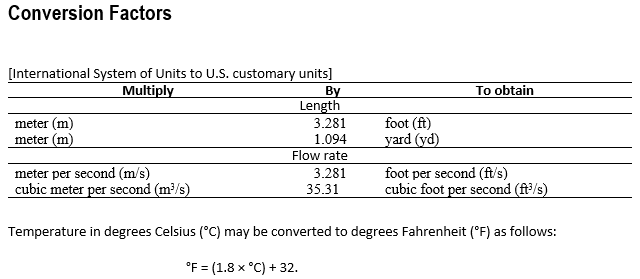

## Abstract
The software program, QRev applies common and consistent computational 
algorithms combined with automated filtering and quality assessment of the 
data to improve the quality and efficiency of streamflow measurements and 
helps ensure that streamflow measurements are consistent, accurate, and 
independent of the manufacturer of the instrument used to make the 
measurement. Software from different manufacturers uses different 
algorithms for various aspects of the data processing and discharge 
computation. The algorithms used by QRev to filter data, interpolate data, 
and compute discharge are documented and compared to the algorithms used in 
the manufacturers’ software. QRev applies consistent algorithms and creates 
a data structure that is independent of the data source. QRev saves an 
extensible markup language (XML) file that can be imported into databases 
or electronic field notes software.

## Introduction
The use of acoustic Doppler current profilers (ADCPs) from a moving boat is 
a commonly used method for measuring streamflow or discharge. The 
development of the ADCP has provided hydrographers and hydrologists with a 
tool that can substantially reduce the time for making streamflow 
measurements and has improved the safety of field personnel. These 
measurements have been reviewed and post-processed using 
manufacturer-supplied software. Using the manufacturer-supplied software 
the review and processing depends on the user’s knowledge and experience to 
interpret the quality of the measurement and set appropriate thresholds to 
screen out erroneous data. Software from different manufacturers use 
different algorithms for various aspects of the data processing and 
discharge computation. Consequently, if the same data set could be processed by each of the manufacturers’ software, the resulting discharges would be different. Development of common and consistent computational algorithms combined with automated filtering and quality assessment of the data will provide substantial improvements in quality and efficiency of streamflow measurements and will ensure that streamflow measurements are consistent, accurate, and independent of the manufacturer of the instrument used to make the measurement.

The computer program QRev can be used to compute the discharge from a 
moving-boat ADCP measurement using data collected with any of the Teledyne 
RD Instruments (TRDI) or SonTek bottom tracking ADCPs and has received 
limited testing with Nortek and Rowe Technology bottom tracking ADCPs. QRev 
applies consistent algorithms for the computation of discharge independent 
of the manufacturer of the ADCP. In addition, QRev automates filtering and 
quality checking of the collected data and provides feedback to the user of 
potential quality issues with the measurement. Various statistics and 
characteristics of the measurement, including a simple uncertainty 
assessment, are provided to assist the user in properly rating the 
measurement. QRev saves an extensible markup language (XML) file that can 
be combined with field notes collected in SVMAQ to facilitate efficient 
loading of results into USGS databases.

### Purpose and Scope
The purpose of this report is to document the algorithms used to process, 
filter, and interpolate the ADCP data; check the measurement for potential 
quality issues; compute discharge; and estimate the uncertainty of the 
measurement.

## Description of Software
QRev was originally developed using Matlab and compiled for release in 2015 
using Matlab version 2015b and compiler and runtime libraries version 9.0. 
QRev has been ported to Python with improvements to the user interface and 
improvements to several features, including changes that affect the 
computation of the final discharge. Most of the code is written using 
object-oriented programming techniques, although a few functions outside of 
an object class are also used. The general design of QRev was guided by the 
following criteria:
1. process SonTek and TRDI data,
2. use consistent algorithms,
3. use the best available data (interpolate only what is missing or invalid),
4. provide a logical workflow,
5. automate data quality assessment and feedback,
6. provide manual overrides for all automated filters,
7. use displays and output designed to evaluate specific problems,
8. provide uncertainty information to the user, and
9. use tablet friendly graphical user interface (GUI).

The GUI, shown in figure 1, is designed to be logical and tablet friendly. 
Once the measurement is opened, the tabs follow a logical left to right 
workflow. The approach leads the user through the premeasurement steps 
first. The boat velocity is determined prior to evaluating the depth so 
that the cross-section is spatially correct. Once the best reference for 
the boat velocities is determined, it can be set by clicking the 
appropriate reference in the toolbar. Then the best depths can be 
determined, and finally the best water velocities, which are dependent on 
boat velocities and depths. Thus, the final discharge is based on the best 
boat velocities, depths, and water velocities that are available.

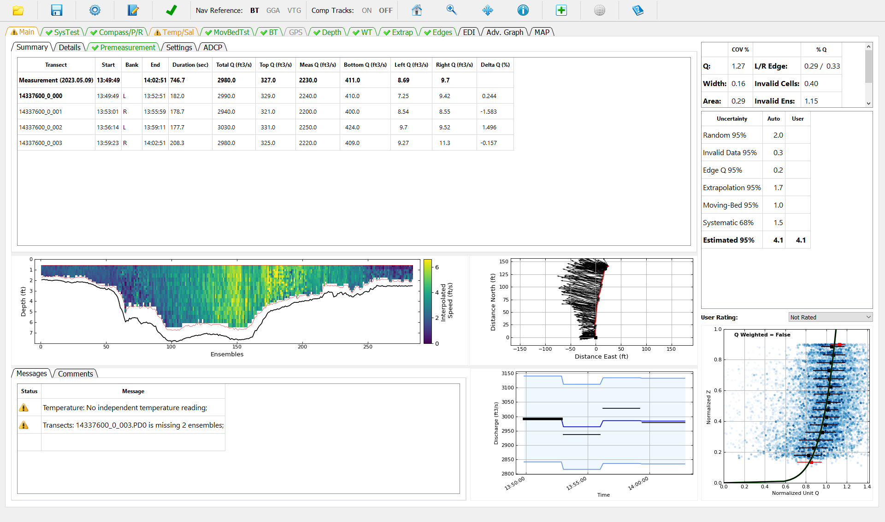
**Figure 1.** QRev main user interface.

The text on the tabs will turn green, yellow, red or blue and have a green 
check mark or a red or yellow warning symbol based on automated data 
quality assessment criteria and any changes to the default settings made by 
the user. If a tab is yellow or red, an associated message in the message 
tab will appear at the bottom of the main window. Tabs, buttons, check 
boxes, radio buttons, and dropdown menus are used in lieu of menus so that 
QRev is easier to use on a touch screen tablet. Each tab opens a window 
that provides tables, text, options, and graphics needed to assess and 
process that particular aspect of the data. Details on the various windows 
are discussed in the QRev User’s Manual.

## Data Processing Algorithms
Before velocity and depth data measured by the ADCP can be used to compute 
discharge, these data must be processed. The processing includes 
transforming the data into Earth coordinates, filtering the data to 
identify invalid data, and estimating the discharge in areas with invalid 
data. Invalid data could be identified by location, such as below the side 
lobe cutoff, or by a quality indicator, such as error velocity. Invalid 
data represent a spatial location within the cross section where valid data 
from which to compute discharge do not exist. Algorithms to estimate values 
for invalid data or the resulting discharge must be used to obtain the best 
possible measurement of discharge. This data processing step is where the 
manufacturers’ software, WinRiver II and RiverSurveyor Live, differ the 
most. This step also is where QRev makes the most improvements in terms of 
accuracy and efficiency when compared to the current approaches used by the 
manufacturer. A summary of the differences in data processing among 
WinRiver II, RiverSurveyor Live, and QRev is listed in Table 1.

### Computing Discharge from Invalid Data
WinRiver II provides the user the ability to filter data that appear to be 
erroneous by manually setting the parameters of several different types of 
filters. Properly setting these parameters requires some experience and may 
be an iterative process. WinRiver II also requires valid depth, boat 
velocity, and water velocity to compute discharge for an ensemble. If any 
of these three data types are not valid, the ensemble is considered invalid 
and the ensemble duration of the next valid ensemble is increased. The 
valid data in the invalid ensemble are effectively ignored, and the invalid 
ensemble is backfilled with data from the next valid ensemble. Global 
Position System (GPS) data, however, are an exception; if a new GPS 
referenced velocity is not valid, the ensemble uses that last valid value.

RiverSurveyor Live does not provide the user with any tools to filter 
erroneous data. If the ADCP fails to obtain a valid depth in an ensemble, 
the previous valid depth is used until a new valid depth is collected. If 
the ADCP fails to obtain a valid bottom track referenced boat velocity for 
an ensemble, the previous valid boat velocity is used until a new valid 
boat velocity is obtained or until 10 ensembles have passed. After 10 
consecutive ensembles with an invalid boat velocity, the boat velocity is 
set to zero for all subsequent ensembles until a valid boat velocity is 
obtained. This approach effectively computes of zero discharge for those 
ensembles assigned a zero boat velocity. If the boat velocity reference is 
set to GGA or VTG and the boat velocity is invalid, the data for that 
ensemble are ignored and the ensemble duration for the next valid ensemble 
is increased.

QRev uses the best available data and interpolates any invalid data. 
Computing discharge requires valid depth, boat velocity, and water velocity.
Valid water velocity data require valid depth and valid boat velocity data. 
Boat velocity and depth data are independent. However, QRev uses transect 
length, which depends on boat velocity, to interpolate invalid depth data. 
Therefore, the workflow in QRev is to filter and interpolate the boat 
velocity so that every ensemble has a boat velocity (measured or 
interpolated) associated with it prior to processing the depth data. The 
depth data are filtered and interpolated so that every ensemble has a depth.
After every ensemble has boat velocities and depths, the water velocity 
data can be processed, filtered, and interpolated. The discharge for each 
ensemble can now be computed because each ensemble has a depth, boat 
velocity, and water velocity. All the valid data are used, and any invalid 
data are interpolated.

Table 1. Summary of difference in software filter capabilities and handling of invalid data.
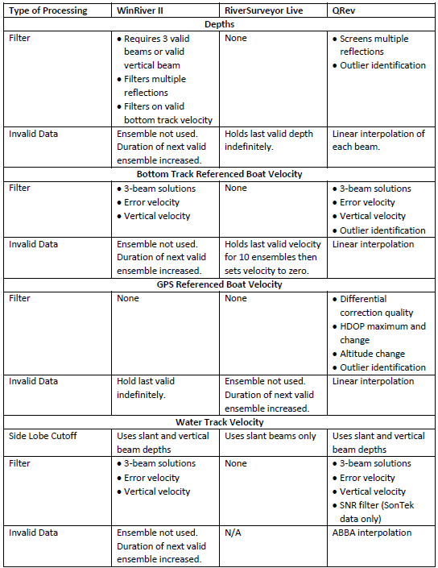

### Coordinate Transformation
Coordinate transformation is required to transform the raw data collected by the ADCP
into orthogonal coordinates that are more convenient for the user. The Doppler shift is along
(parallel to) the acoustic beams. Thus, the ADCP measures velocity vectors parallel to the four
slant beams, which are typically referred to as beam velocity or beam coordinates. Those four
vectors can be transformed into an orthogonal coordinate system, which is often referred to as
instrument coordinates or x, y, and z coordinates (u, v, and w for velocity components). Only
three beams (vectors) are required to complete the transformation from beam coordinates to an
orthogonal coordinate system.

For ADCPs with four beams, a fourth component can be computed. This fourth
component is the difference in vertical velocity determined from each pair of opposing beams.
SonTek refers to this fourth component as a difference velocity (SonTek, 2015), and TRDI scales
the difference velocity and calls it an error velocity (Teledyne RD Instruments, 1998). The error
velocity is scaled so that its magnitude (root-mean-square) matches the mean of the magnitudes
of the horizontal velocity components (u and v). This scaling has been chosen so that in
horizontally homogeneous flows, the variance of the error velocity will indicate the part of the
variance of each of the horizontal components (u and v) attributable to instrument noise
(Teledyne RD Instruments, 1998). If the flow field is homogeneous, the difference between these
vertical velocities will average to zero. QRev applies this equation to data from TRDI and
SonTek ADCPs and uses the equation to screen for invalid data. The following equations are
used to transform beam coordinates to instrument coordinates for a four-beam ADCP:

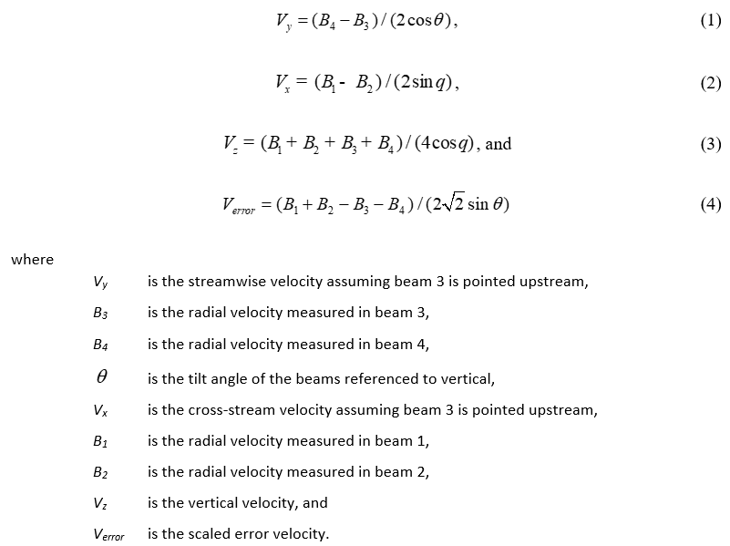
*Note:* Radial velocities are positive away from the transducer and negative 
towards the transducer.

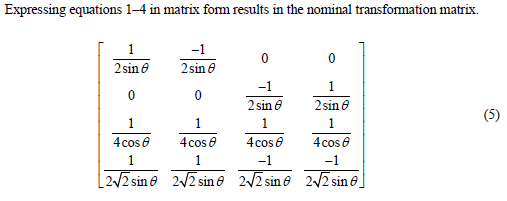

The matrix is referred to as the nominal matrix because it is the perfect 
or ideal matrix. However, during manufacturing the transducers may not be 
potted perfectly resulting in some misalignment. The manufacturers test 
each ADCP and create a custom transformation matrix that accounts for the 
misalignment of the beams in each ADCP. QRev reads this custom matrix from 
the raw data, and if necessary, applies the matrix to the raw beam velocities.

The data are further transformed to correct for pitch and roll to produce 
what TRDI refers to as ship coordinates (Teledyne RD Instruments, 1998). An 
additional transformation to rotate the instrument coordinates for the 
heading measured by an internal or external compass, results in Earth or 
ENU (east, north, up) coordinates. QRev automatically applies the required 
transformations to convert the imported data to Earth coordinates. All 
computations in QRev are completed using Earth coordinates. For ADCPs that 
do not have a compass, the heading, pitch, and roll are set to zero and the 
transformation results in instrument coordinates.

If a four-beam ADCP only measures a valid Doppler shift on three beams, a 
three-beam solution for the x, y, and z velocity components is possible, 
but the error velocity cannot be computed. QRev uses the approach 
documented in Teledyne RD Instruments (1998) to compute u, v, and w using 
three beams. The invalid beam velocity is replaced with a value calculated 
from the last row of the instrument transformation matrix so as to force 
the error velocity to zero. The transformation from beam to instrument 
coordinates is then calculated in the usual way using the first three rows 
of the instrument transformation matrix.

### Boat Velocity
To compute the water velocity, the velocity of the ADCP traversing the 
stream must be measured. Because the ADCP is typically deployed on a boat 
manned or tethered, the velocity of the ADCP is often referred to as the 
boat velocity. The boat velocity can be referenced to the bottom track, GGA,
or VTG. QRev applies filters to each of these references to identify 
erroneous data. Erroneous data are marked invalid and are replaced with 
either a value from linear interpolation or from one of the other available 
boat velocity references if the composite tracks function is turned on. 
Although the filters for the various boat velocity references are different,
the interpolation algorithm for invalid data is the same.

#### Bottom Track Filters
QRev includes the same filters used by WinRiver II: three-beam solutions, 
error velocity, and vertical velocity. Unlike WinRiver II where these 
filters must be set manually, QRev automatically determines the appropriate 
thresholds and applies the filters to data collected by either TRDI or 
SonTek ADCPs. In addition, QRev implements an outlier detection method.

#### Beam Filter
Current (2020) TRDI and SonTek ADCPs are based on a four-beam Janus 
configuration. Most bottom track velocity solutions will use all four beams,
although three beams are all that is required to compute u, v, and w 
velocities in orthogonal coordinates (x, y, and z). If one of the beams 
fails to provide a sufficient acoustic return for the Doppler shift, the 
boat velocity can be computed using the remaining three beams. In field 
applications, three-beam solutions can produce reliable velocities; however,
the three-beam solution occasionally will be in obvious error. QRev 
provides the following three options for dealing with three- and four-beam 
solutions: (1) accept only four-beam solutions, (2) allow three-beam 
solutions, and (3) automatic mode, which is the default in QRev. In the 
automatic mode, the u and v components of the velocities associated with 
the three-beam solutions are compared to adjacent or nearby u and v 
components of the four-beam solution velocities. If both components of the 
three-beam velocities are within plus or minus (+/-) 50 percent of the 
respective components for the four-beam velocities, the three-beam velocity 
is assumed valid; conversely, if either component of the three-beam 
velocities is not within +/- 50 percent of the respective components for 
the four-beam velocities, the three-beam velocity is marked invalid.

#### Error Velocity
QRev applies equation 4 to data from TRDI and SonTek ADCPs and uses the 
results of the equation to identify and mark erroneous data invalid. 
Horizontal velocities in an ensemble where the error velocities are outside 
the threshold are considered invalid. Bottom pings are categorized by 
frequency for the SonTek M9. Like WinRiver II, QRev allows the user to 
manually set a threshold for error velocity or to turn error velocity 
filtering off. The manual setting only allows a single threshold that is 
applied uniformly to all bottom ping types. However, by default QRev 
computes this threshold automatically using a statistical measure of 
variance for each bottom ping type. Instrument noise associated with an 
ADCP is random and, thus, should follow a normal or Gaussian distribution. 
Therefore, using a measure of variance, outliers can be automatically 
identified. QRev uses +/- five times the interquartile range of all valid 
data as the automatic threshold. QRev computes the threshold, marks all 
outliers invalid, and repeats until no additional outliers are identified. 
Thus, only obvious outliers are identified and marked invalid.

Using the Options dialog, the filters can be applied based on the 
interquartile range for each individual transect or for the entire 
measurement. Using the entire measurement results in a threshold for each 
ping type.

#### Vertical Velocity
Typically, ADCPs deployed on a boat, manned or tethered, traversing a 
stream would have little or no vertical boat velocity relative to the 
streambed, except for that caused by wave action. On average, assuming that 
the stage of the stream is not changing, the vertical boat velocity 
averaged over a transect should be zero. The measured vertical boat 
velocity in each ensemble would be the result of wave action or instrument 
noise. Thus, like error velocity, the distribution of vertical boat 
velocities for a transect could be expected to be random. Deviations from a 
random distribution would suggest that the data are erroneous or that one 
of the assumptions is invalid. QRev applies the same approach to filtering 
vertical boat velocity as that described for error velocity.

#### Other Outlier Identification Methods
The boat velocity for a transect is a time series of velocities. The 
variation in velocity from one ensemble to the next is a function of the 
time between ensembles and boat operation. A best practice for measuring 
discharge with an ADCP from a moving boat is to operate the boat smoothly 
without sudden accelerations, decelerations, or turns (Mueller and others, 
2013). Therefore, an algorithm that can smoothly fit the time series of 
boat velocities could be used to identify outliers or erroneous data. QRev 
uses a robust locally weighted scatterplot smooth (LOESS) (Cleveland, 1979; 
Cleveland and Devlin, 1988) and a dynamically adjusted moving window with 
empirically derived settings to help identify outliers in boat speed. This 
filter is not applied automatically and defaults to off. Other algorithms 
that are more robust may be researched and included in future releases.

#### Computing Boat Velocity from GGA Data
The GGA sentence is defined by the NMEA 0183 standard (National Marine Electronics
Association, 2002) and contains the time, horizontal position, differential quality, measure of
horizontal dilution of precision, and altitude among other variables. The boat velocity is
determined from the position in the GGA sentence by dividing the distance between successive
positions by the time elapsed between those positions (differentiated position). To compute
differentiated positions, the latitude and longitude must be transformed to x and y rectilinear
components. The latitude and longitude could be transformed to x and y rectilinear components
by computing the Universal Transverse Mercator (UTM) coordinates for the geographic
positions; however, TRDI uses the following equations:

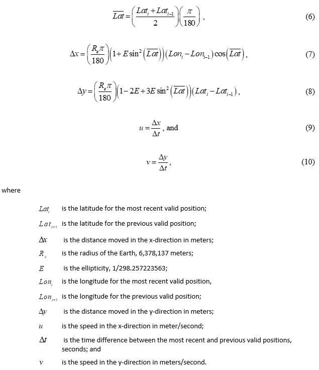

The results using UTM or equations 6–10 are similar but not exact for the UTM
algorithms used in QRev. QRev is using the TRDI equations for consistency with previous
measurements.

#### GGA Filters
Use of differentiated position requires accurate position solutions. The accuracy of the
position data is affected by the differential correction applied to the data, the configuration of the
satellites, and the path of the signal from the satellite to the GPS antenna (multipath).

#####Differential Correction Quality
The GGA sentence contains a variable that indicates the quality or type of differential
correction associated with the position. Although GPS receiver manufacturers have some
differences, generally the quality is defined as follows:
- 0, no position fix
- 1, autonomous
- 2, differential correction
- 4, real-time kinematic
- 5, float real-time kinematic

QRev provides the user the option of accepting all data with a quality of 
one or greater, two or greater, and four or greater. The default is two or 
greater. Any position that does not meet or exceed the quality setting is 
marked invalid.

##### Altitude Filter
Data collected from a boat traversing a stream should have a nearly 
constant altitude, excepting vertical movement because of wave action, 
which for inland waterways is typically minimal. Thus, the altitude 
measured from the GPS receiver on the boat should be nearly constant. The 
altitude measured by a GPS receiver is typically about three times less 
accurate than the horizontal position (http://water.usgs.gov/osw/gps/). 
Thus, for a GPS receiver with submeter differentially corrected accuracy, 
the vertical accuracy would be about 3 meters (9.8 feet). The GPS tabular 
view in WinRiver II turns the altitude field red if the altitude changes by 
more than 3.5 meters (11.5 feet) during a transect, but the data are not 
marked invalid (Teledyne RD Instruments, 2014). QRev provides the ability 
to mark GPS data invalid based on the change in altitude during a transect. 
The altitude filter in QRev defaults to an automatic setting and uses a 
threshold of +/- 3 meters from the mean of valid altitudes in the transect. 
The mean altitude for all valid altitudes is computed, altitudes exceeding 
the filter are marked invalid, and the process is repeated until all valid 
altitudes are within the threshold. The user can change the filter setting 
to manual and adjust the threshold to any desired value or turn the filter off.

*Horizontal Dilution of Precision (HDOP)*

Dilution of precision is a term used to characterize the geometric 
configuration of the satellites and its effect on the accuracy of the GPS 
position fix. The lower the dilution of precision, the better the accuracy 
of the position fix. Position dilution of precision is commonly used and 
provides an overall rating of precision of horizontal and vertical 
positions. However, only the horizontal position accuracy generally is of 
interest for boat velocity reference, and the horizontal dilution of 
precision (HDOP) is available in the GGA sentence.

WinRiver II displays the HDOP and change in HDOP during a transect in the 
GPS tabular view. These values are red if the HDOP exceeds two or the 
change in HDOP within a transect is greater than one. QRev expands on this 
approach by using HDOP as a filter to mark GPS data invalid. The QRev 
filter marks all data with an HDOP value greater than 4 invalid. The value 
of 4 is based on user field experience where GPS data were useful for 
discharge measurements when HDOP was as high as 4. The mean HDOP for the 
transect is then computed using the valid data, and all data with a 
deviation from the mean greater than the change threshold (3) are marked 
invalid. The process is repeated until all valid data meet the filter 
criteria. The user can change the filter to manual and adjust the HDOP and 
the change in HDOP thresholds or turn the filter off.

##### Other Outlier Identification Methods
The same outlier identification methods discussed in “Bottom Track Filters” can be applied to boat velocities referenced to GGA. This filter is not applied automatically and defaults to off.

#### VTG Filters
The velocity reported in the NMEA VTG sentence contains only a velocity and 
direction. The velocity is typically based on measured Doppler shifts in 
the satellite signals, but some receivers may use differentiation of 
successive positions to compute the reported velocity. Wagner and Mueller 
(2011) determined that VTG can be a valid alternative for measuring 
discharge with an ADCP in moving-bed environments without the assistance of 
differential corrections; however, VTG-based discharges may be inaccurate, 
particularly for boat speeds less than about 0.8 foot per second. Use of 
the Doppler shift to determine velocity does not require and is unaffected 
by differential corrections. This velocity measurement can be robust 
because it is resistant to some of the errors that are problematic for 
position determination, such as multipath errors.

##### Horizontal Dilution of Precision (HDOP)
The geometry of the satellites affects the accuracy of the velocity 
measured by the Doppler shift. The VTG sentence does not provide any data 
quality parameters. If the GGA sentence is available, QRev applies the same 
HDOP filtering to VTG data as described for GGA data.

##### Other Outlier Identification Methods
The same outlier identification methods discussed in “Bottom Track Filters” 
can be applied to boat velocities referenced to VTG. This filter is not 
applied automatically and defaults to off.

#### Interpolation
Linear interpolation is used to estimate boat velocities that have been 
determined to be invalid. The same interpolation algorithm is used for boat 
velocities referenced to bottom track, GGA, and VTG. Linear interpolation 
is applied to each velocity component (u and v) with ensemble time as the 
independent variable. QRev maintains a record of the source of the velocity 
so that those velocities that have been interpolated are easily identified.

#### Composite Tracks
Composite tracks allows use of one of the other available boat velocity 
references to replace invalid data in the primary boat velocity data. 
RiverSurveyor Live implements composite tracks as listed in table 2. QRev 
implements a simpler progression as listed in table 3. A more complex 
scheme that includes the quality of the differential correction, as used by 
RiverSurveyor Live, or that includes some combining of all available 
sources like a Kalman filter may be considered for future development.

Table 2. Progression of boat velocity reference in RiverSurveyor Live when 
composite tracks are enabled (D.S. Mueller, U.S. Geological Survey, written 
commun., 2008). [BT, bottom track, RTK, real-time kinematic]
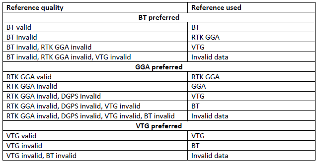

Table 3. Progression of boat velocity reference in QRev when composite tracks are enabled. [BT, bottom track, RTK, real-time kinematic]
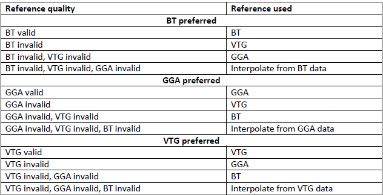

### Depths
The depth from water surface to streambed used to compute discharge is 
determined from the draft of the ADCP and either from the average of the 
four beam depths from the four slant beams (referred to hereafter as BT) or 
from the depth from the vertical beam (VB) for those ADCPs equipped with a 
vertical beam. The draft or transducer depth is measured and entered in the 
data collection software (WinRiver II or RiverSurveyor Live) by the user. 
QRev allows the user to edit the draft if an error was made in the original 
entry. If the ADCP is equipped with a vertical beam, the user can select to 
use the VB depth, the BT depth, or a composite depth in the manufacturers’ 
software or in QRev. How the BT depth is computed from the four slant beams 
and how composite depths are implemented are different in the 
manufacturers’ software and QRev.

The manufacturers and QRev use different methods to compute the vertical 
depth from the slant beams. Both methods adjust the slant range for the 
designed angle of the beams from the vertical. SonTek also corrects the 
depths measured by the slant beams and vertical beam for pitch and roll, 
but TRDI does not (SonTek, 2015; Teledyne RD Instruments, 2007). QRev uses 
the vertical depths provided by the manufacturers. Implementing pitch and 
roll compensation for the measured depths is a future version is being 
considered. A preliminary assessment indicated about a 0.4 percent change 
in average depth for a mean pitch or roll of 5 degrees.

The method used to compute the BT depth from the four slant beams is also 
different between the manufacturers. SonTek uses a simple numerical average 
of the four beam depths. TRDI has the option of a simple numerical average, 
but the default is an inverse depth weighted (IDW) average (SonTek, 2015; 
Teledyne RD Instruments, 2014). QRev uses the IDW average computed using 
the following equations:

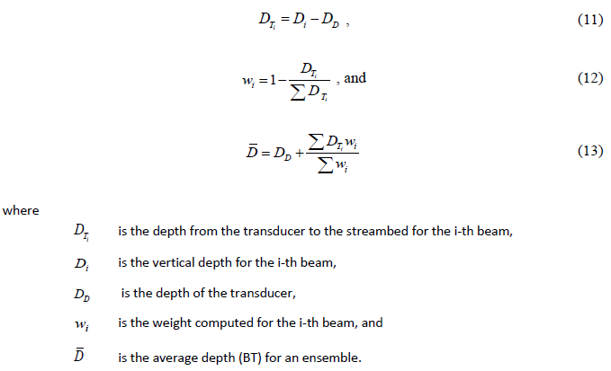

#### Filters
Depths from individual beams, whether slant beams or the vertical beam, occasionally
contain spikes in the measured depth. These spikes may be shallow and caused by aquatic life or
by debris somewhere in the water column. These spikes may also be deep and caused by the
ADCP digitizing the multiple of the acoustic return. RiverSurveyor Live does not provide any
filtering of the depths. WinRiver II has several options for filtering the depth data from the slant
beams. To screen spikes, WinRiver II uses an algorithm that marks a beam invalid if it is more
than 75 percent different from the other beams (Teledyne RD Instruments, 2014). WinRiver II
also requires at least three valid beam depths or the average depth for the ensemble is considered
invalid. WinRiver II also has an option to mark all depths invalid that are not associated with a
valid bottom track velocity (Teledyne RD Instruments, 2014).

QRev uses a similar 75 percent criteria to identify spikes in the slant beams. The ratio of
each beam to the other beams is computed, and if the ratio exceeds 1.75, 
the beam in the  numerator is marked invalid. This method is intended to 
filter out depths that are too deep because of the ADCP digitizing the 
second reflection rather than the first reflection. If used 
indiscriminately, this filter will tend to bias the depth to the shallower 
depths. This filter is not applied automatically and defaults to off.

QRev also uses an outlier identification method using a robust LOESS smooth 
similar to that described in the “Boat Velocity” section. Like the boat 
velocity, the depths from each beam form time series of depths. Most 
cross-sections vary gradually and sudden deviations from the trend are 
indicative of erroneous values. Therefore, an algorithm that can smoothly 
fit the time series of depths for each beam could be used to identify 
outliers or erroneous data. QRev uses a robust LOESS smooth and a 
dynamically adjusted moving window with empirically derived settings to 
help identify outliers. The smooth and dynamic windows are computed, and 
the outliers removed. If outliers were found the process is repeated. In 
addition, a maximum depth limit is computed as 3 times the 90th depth 
percentile. All values deeper than the maximum depth limit are considered 
outliers. This filter is applied automatically but may be turned off by the 
user. Other algorithms that are more robust may be researched and included 
in future releases.

#### Interpolation
QRev uses linear interpolation to estimate beam depths for any data determined to be invalid. The linear interpolation is applied to each beam prior to computing the average depth for an ensemble. The independent variable in the linear interpolation is the cumulative length along the transect path.

### Composite Depths
Composite depths allows the use of the depth from a secondary depth source when the depth from the primary source is invalid. Composite depths is available for TRDI ADCPs equipped with a vertical beam (RiverRay and RiverPro). TRDI’s implementation gives first preference to the vertical beam, then to the depth sounder (if available), and then to the average of the four slant beams (Teledyne RD Instruments, 2014). This setting is the default setting in WinRiver II. SonTek’s implementation of composite depths does not support an external depth sounder and allows the user to select the primary reference (average of the four slant beams or the vertical beam) and sets the other as the secondary reference (SonTek, 2015). QRev extends the manufacturers’ implementations to support user selection of the primary reference and to include the external depth sounder and linearly interpolated depths as other options (table 4). If data from an external depth sounder are available, QRev assumes that the user had a good reason for collecting data with the depth sounder; therefore, depth sounder data (if not selected as primary) are assumed as the first option. If none of the available depth sources provide a valid depth, QRev will use a value determined from linear interpolation of the valid composite depths.

**Table 4.** QRev priority for composite depths. [BT, average depth from four 
slant beams; DS, depth from external depth sounder; VB, depth from vertical beam]
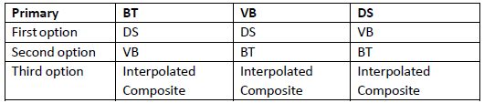

### Water Track
Water track data can only be processed after valid depths and boat 
velocities have been determined. The valid depths are used to determine the 
location of the side lobe cutoff. The boat velocity is used to compute a 
water velocity relative to a fixed reference rather than a moving
boat. Finally, the water velocities are filtered, and invalid data interpolated.

#### Side Lobe Cutoff
An ADCP cannot measure the water velocity near the streambed because of side-lobe
interference (fig. 2). Most transducers that are developed using current (2020) technology emit
parasitic side lobes off of the main acoustic beam. The magnitude of the energy in a side lobe
reflected from the streambed is sufficiently close to the magnitude of energy in the main beam
reflected from scatterers in the water column to cause potential errors in the measured Doppler
shift. The portion of the water column near the streambed affected by this side-lobe interference
varies from 6 percent for a 20-degree system to 13 percent for a 30-degree system and can be
computed as follows:

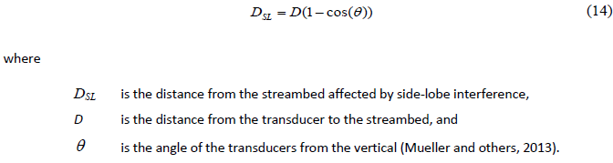

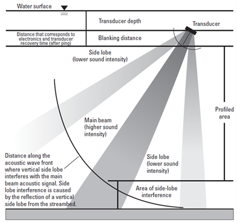
**Figure 2.** Acoustic Doppler current profiler beam pattern and locations of 
unmeasured areas in each profile (from Simpson, 2002).

The distance from the streambed potentially affected by the side lobe is computed in
equation 14; however, to determine the last valid depth cell in a profile requires the depth cell
size, transmit length, and lag between transmit pulses to be accounted for. TRDI determines the
last valid depth cell for standard modes (Teledyne RD Instruments, 2014) as follows:

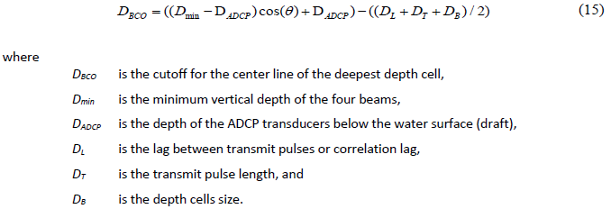

For TRDI pulse coherent modes, the lag is equal to the depth and, thus, is not considered
in the cutoff computation and equation 15 becomes,

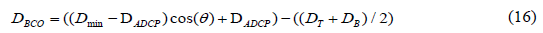

For TRDI ADCPs with a vertical beam, if the vertical beam is selected as the primary depth
reference or used in composite depths the Dmin is the minimum depth of all five beams.
SonTek’s algorithms for handling the side lobe cutoff for RiverSurveyor ADCPs (Lyn
Harris, SonTek, written commun., 2014) can be restated in the form of equation 16. SonTek also
replaces the cos( ) with a user defined percentage that defaults to 10 percent.

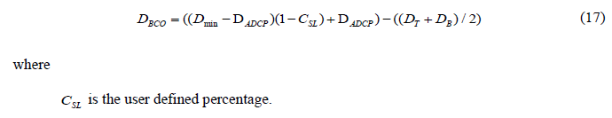

QRev uses the same approach as the manufacturers in handling the side lobe when the
beams are valid. If none of the beams have a valid depth, QRev uses the mean depth computed
from the linear interpolation as min D . If one or more of the beams are invalid, the side lobe cutoff
is computed based on the mean depth using the interpolated and valid beam depths and is
compared to the side lobe cutoff using the minimum of the valid beams. If the side lobe cutoff is
shallower using the mean depth, the side lobe cutoff is adjusted. Only bins with a center line
depth less than DBCO, computed using equations 15–17, are used to compute discharge. SonTek
and TRDI allow the user to specify additional bins above the side lobe to be marked invalid. This
feature is not supported in QRev but will be considered for a future release.

#### Filters
QRev includes the same water track filters used by WinRiver II—three-beam 
solutions, error velocity, and vertical velocity and in addition, a 
signal-to-noise ratio (SNR) filter. QRev defaults to an automated 
application of these filters. The three-beam solutions, error velocity, and 
vertical velocity filters are applied to the water velocity in individual 
depth cells. The SNR filter is only applied to SonTek data and is applied 
to an ensemble.

##### Beam Filter
Current (2015) TRDI and SonTek ADCPs are based on a four-beam Janus 
configuration. Most water track velocity solutions will use all four beams, 
although only three beams are required to compute u, v, and w velocities in 
orthogonal coordinates (x, y, and z). If one of the beams fails to provide 
a sufficient acoustic return for the Doppler shift, the velocity can be 
computed using the remaining three beams. In field applications, three-beam 
solutions can produce reliable velocities; however, the three-beam solution 
occasionally will be in obvious error. QRev provides the following three 
options for dealing with three- and four-beam solutions: 
1) accept only four-beam solutions
2) allow three-beam solutions
3) automatic mode (default) 
 
In the automatic mode, QRev identifies all three-beam solutions. The u and 
v components of the velocities associated with the three-beam solutions are 
estimated from interpolation using adjacent or nearby u and v components of 
the four-beam solution velocities. If both components of the measured 
three-beam velocities are within +/- 50 percent of the estimated velocities 
from interpolation, the three-beam velocity is assumed valid, if not, the 
three-beam velocity is marked invalid.

##### Error Velocity
QRev applies equation 4 to water velocities in individual depth cells for 
TRDI and SonTek data and uses the equation to identify and mark erroneous 
data invalid. Horizontal velocities in a depth cell where the error 
velocities are outside the threshold are considered invalid. Like WinRiver 
II, QRev allows the user to manually set single threshold for error 
velocity which is applied uniformly to all ping types or to turn error 
velocity filtering off. However, by default, QRev computes this threshold 
automatically using a statistical measure of variance for each ping type.

- *TRDI ADCPs:* I : Incoherent, C : Coherent, S : Surface Cell
- *SonTek M9 and S5:*  1I : 1MHz Incoherent, 1C : 1 MHz HD, 3I : 3 MHz 
  Incoherent, 3C : 3 MHz HD
- *SonTek RS5:* BB : BroadBand, PC : Pulse Coherent, PC/BB : combination
- *Unknown:* U : to indicate categories are unknown and not used

Instrument noise associated with an ADCP is random and, thus, should follow 
a normal or Gaussian distribution. Therefore, using a measure of variance, 
outliers can be automatically identified. QRev uses +/- five times the 
interquartile range of all valid data as the automatic threshold for 
determining outliers. QRev computes the threshold, marks all outliers 
invalid, and repeats the process until no additional outliers are 
identified. Thus, only obvious outliers are identified and marked invalid.

Using the Options dialog, the filters can be applied based on the 
interquartile range for each individual transect or for the entire 
measurement. Using the entire measurement results in a single threshold for 
each ping type.

##### Vertical Velocity
Generally, the vertical velocities in a cross-section would average to zero;
however, depending on channel configuration and proximity to hydraulic 
structures, this assumption may not be valid. Because vertical velocities 
in a cross-section cannot be assumed to average to zero, filtering on 
vertical water velocities is more difficult than filtering on error 
velocities. Despite this complexity, experience has indicated that 
application of the same filtering approach used with error velocities is 
generally effective for vertical velocities. QRev applies an automatic 
filter using the same approach as the error velocity filter to vertical 
velocities. If significant real variations exist in the vertical velocity, 
the data may be better represented by turning off the vertical filter.

##### Flow Disturbance
The immersion of the ADCP into the flowing water and the boat and mount 
used to deploy the ADCP will create a disturbed flow field around the ADCP 
that no longer represents the free stream velocities (Mueller and others, 
2007). Model and field data comparisons have determined that the default 
blanking distance for most ADCPs is adequate to block data collection in 
the disturbed region (Mueller, 2015).

The SonTek RiverSurveyor M9 is an exception. The USGS policy is that data 
in the range from 0 to 0.16 meter from the transducer be considered invalid 
(Office of Surface Water, 2013). QRev automatically enforces this policy 
for data collected with a SonTek RiverSurveyor M9 by setting the excluded 
distance to 0.16 meter. If a screening distance is set in RiverSurveyor 
Live such that the excluded distance is greater than 0.16 meter, that 
greater distance is used by QRev; however, if the screening distance in 
RiverSurveyor Live is set such that the excluded distance is less than 0.16 
meter, QRev will set the exclude distance to 0.16 meter. The excluded 
distance is measured from the transducer face and can be edited by the user.

The TRDI RioPro is also an exception. The RioPro uses the same processing 
algorithms as the smaller RiverRay but is housed in the Rio Grande case and 
uses Rio Grande transducers. Tests and model results showed that the 
default bank of 0.25 meters for the Rio Grande was adequate. However, the 
processing algorithms in the RioPro do not support a user specified blank 
of 0.25 meters so QRev automatically sets the excluded distance to 0.25 
meters for the RioPro.

##### Signal-to-Noise Ratio Filter
Air entrainment beneath the SonTek RiverSurveyor ADCPs can cause the 
effective beam angles to deviate from the actual angles, and experience has 
indicated that this deviation often results in measured velocities and 
discharge that are biased low. The air entrainment can be identified by a 
separation of the beams in a profile plot of the beams SNR (fig. 3). 
Empirical analysis of numerous measurements made with a SonTek 
RiverSurveyor M9 resulted in a simple filter to identify ensembles with 
potential air entrainment. The filter computes the mean SNR for each beam 
in each ensemble using SNR data from depth cells below the excluded 
distance and above the side lobe cutoff. The SNR range is computed as the 
difference in SNR for the beams with the minimum and maximum mean SNR in 
each ensemble. Any ensemble with a range greater than 12 decibels is 
assumed to be affected by air entrainment and the velocities are then 
either marked invalid or reprocessed to check for a valid 3-beam solution 
depending on settings in the QRev.cfg file.

The 3-beam solution is computed by first transforming the Earth coordinates 
to beam coordinates by multiplying the earth velocities by the inverse of 
the heading, pitch, and roll matrix and then by the inverse of the 
transformation matrix. For each ensemble, any beam with an average SNR that 
is less than 12 decibels from the beam with the maximum average SNR is 
marked invalid and the beam velocity data for that beam removed from the 
computed beam velocities. The beam velocities are then recomputed to obtain 
earth velocities. A velocity based on a 3-beam solution will be computed 
for ensembles with one of the beams marked invalid. The beam filter will 
then be reapplied to these data. This approach allows a 3-beam solution for 
ensembles where one beam is marked invalid due to the SNR filter.

This filter is only applied to data collected with SonTek ADCPs.

#### Interpolation
QRev interpolates water velocity data that have been determined to be invalid by using a different approach than that used by the manufacturers. There are no interpolation algorithms in RiverSurveyor Live for water data. TRDI in WinRiver II does not interpolate water velocities but accounts for the invalid data by interpolating or extrapolating the cross product of the water and boat velocities used in the discharge computation (see “Computing Discharge from Invalid Data” section). QRev uses a different approach for estimating water velocities. Previous Matlab based versions of QRev used a two-dimensional linear interpolation method called scatteredInterpolant, which is available in Matlab version 2015b, in combination with TRDI’s approach for invalid data at the top and bottom of the profile. QRev 4.xx uses a purpose-built interpolation method called ABBA (above, below, before, after). The velocity for all depth cells with invalid velocities between the bottom of the blank or excluded distance and the side lobe cutoff are estimated using the abba method.

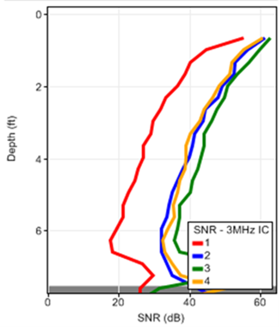
**Figure 3.** Example of air entrainment partially blocking the acoustic 
signal in beam 1 from RiverSurveyor Live. [ft, feet; SNR, signal to noise ratio; dB, decibels; MHz, megahertz; IC, incoherent].

The ABBA interpolation method is designed to utilize the fact that depth cells represent a grid of rectangles in the cross section. The object is to identify neighboring depth cells with valid data and use those cells to estimate velocity components for the invalid cell. The general steps are:
1. Above: Find the first valid cell above the invalid cell within the same 
ensemble. If there are no valid data above the invalid cell, then no above neighbor is used in the interpolation.
2. Below: Find the first valid cell below the invalid cell within the same ensemble. If there are no valid data below the invalid cell, then no below neighbor is used in the interpolation.
3. Compute the extents of each depth cell. The top of each depth cell is the depth cell depth to the center less half of the depth cell size. The bottom of each depth cell is the depth cell depth to the center plus half of the depth cell size.
4. To identify the before and after neighbors, depth cell depths and extents are normalized by the ensemble depth. Using normalized data maintains the consistency of the profile shape between ensembles of differing depths.
5. Before: Search ensembles before the ensemble containing the invalid depth until a previous ensemble has one or more depth cells that overlap the extents of the invalid cell, while honoring the bathymetry. If the beginning of the transect is reached without finding overlapping valid data, then no before neighbor is used in the interpolation.
6. After: Search ensembles after the ensemble containing the invalid depth cell until a previous ensemble has one or more depth cells that overlap the extents of the invalid cell, while honoring the bathymetry. If the end of the transect is reached without finding overlapping valid data, then no after neighbor is used in the interpolation.
7. Compute the distance from the center of the invalid depth cell to the center to each of the identified valid neighboring depth cells using the actual location of the cells, even if the neighbors were identified using normalized data.
8. Estimate the u and v velocity components for the invalid depth cell using an inverse distance weighted average of the u and v velocity components from the identified valid neighboring depth cells.

To honor the bathymetry when searching before and after for neighboring 
depth cells, a check is made using the actual bottom of the depth cell 
compared to the depth of each before or after ensemble. If the bottom of 
the invalid depth cell is deeper than the ensemble depth of the before or 
after ensemble, it is determined that there is no neighbor in that 
direction. This check prevents a situation where valid neighboring cells 
could be identified on the opposite side of a shallow area and thus should 
not logically be considered a neighbor.

### Extrapolation Methods
The ADCP is unable to measure the water column (fig. 4). Near the water 
surface, an unmeasured zone is associated with the immersion of the ADCP 
into the water and a distance below the transducers where valid data cannot 
be obtained because of ringing, flow disturbance, and ping configuration. 
The ADCP also cannot measure all the way to the streambed because of the 
potential for side-lobe interference. The discharge estimates for the top 
and bottom unmeasured portions of the transect are dependent on the 
selected extrapolation methods. The extrapolation methods available in 
WinRiver II, RiverSurveyor Live, and QRev are similar.

- Top and bottom power fit—The power law (Chen, 1989) is applied to the data 
and used to extrapolate the top and bottom unmeasured areas.
- Top constant—Assumes the velocity or discharge is constant from the 
  uppermost depth cell to the water surface.
- Top three-Point—Uses a linear least squares extrapolation through the 
  uppermost three depth cells to the water surface.
- Bottom no slip: Uses the assumption that the water velocity (and hence 
  the discharge) should be zero at the solid boundary and fits a power curve through zero at the bottom and through depth cells in the lower 20 percent of the flow or the last valid depth cell, if no valid bins are in the bottom 20 percent of the water column (specific details may differ among manufacturers).

The user is responsible for evaluating the profile and selecting the 
appropriate method for the top and bottom extrapolations. Currently (2020), 
the manufacturers’ software assumes the manually selected extrapolation 
methods are valid for the transect. In other words, the extrapolation 
methods cannot be changed for different parts of the cross-section.

Using the approach documented in Mueller (2013), QRev provides an automated 
selection of an appropriate extrapolation fit for the measurement. The 
automatically selected

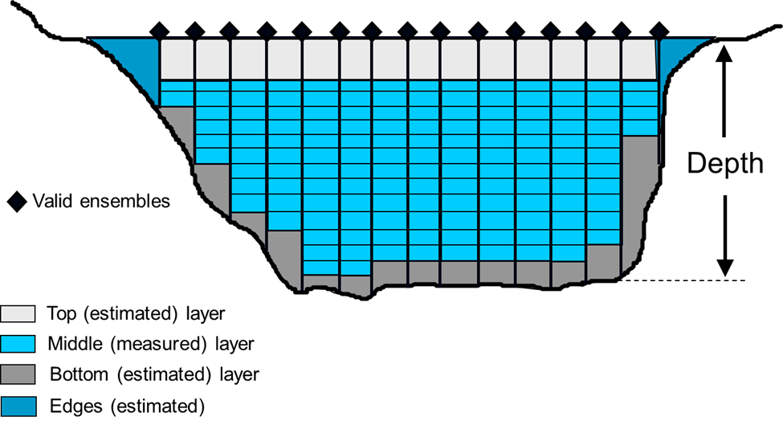
**Figure 4.** Illustration of measured and unmeasured zones of an acoustic 
Doppler current profiler transect.

extrapolation method is the default method in QRev. However, the user 
should review the selected method to ensure a valid fit of the profile and 
make manual adjustments as appropriate.

The method documented in Mueller (2013) for combining all transects of a 
measurement onto a single normalized plot and then using selected 
statistics to determine an extrapolation method that fit the data was based 
on TRDI’s approach (Teledyne RD Instruments, 2014) of using the cross 
product to compute the top and bottom discharge. Thus, the method in 
Mueller (2013) for determination of the best extrapolation method did not 
account for varying depth cell size and ensemble duration, which is now 
common in ADCPs with autoadaptive modes. In order to include the influence 
of depth cell size and ensemble duration in the determination of the best 
extrapolation method, QRev provides the option of using a discharge 
weighted median (https://en.wikipedia.org/wiki/Weighted_median). The 
weights used in the discharge weighted median are the relative measured 
discharge for each ensemble. The measured discharge is the discharge for 
each valid cell and does not include estimates of the top, bottom, left 
edge, and right edge (see equations 18-20 in the Discharge section). The 
relative measured discharge of the ensemble is computed by dividing the 
absolute value of the sum of all valid depth cell discharges in an ensemble 
by the absolute value of the sum of depth cell discharges in the transect. 
The weight computed for an ensemble is applied to all cells withing the 
ensemble. The weighted median is then computed using the cross products and 
the discharge derived weights. The weighted median gives more weight to 
ensembles containing greater discharge when determining the median used in 
the automatic method.

The automatic approach uses linear least squares regression and several 
empirically developed criteria for selecting the appropriate extrapolation 
method. The automated method will attempt to select the best from among the 
following extrapolation methods:
- power fit through the profile with an exponent of 0.1667 (default),
- power fit through the profile with a linear least-squares fit exponent,
- constant fit at the top and a no slip fit at the bottom with an exponent 
  of 0.1667, and
- constant fit at the top and a no slip fit at the bottom with a linear 
  least-squares fit exponent.

The approach used in the automatic fit algorithm is that the data follow the power law with an exponent of 0.1667 unless the measured data are sufficient to prove otherwise. The following is a list of steps that are used to automatically select the appropriate extrapolation method.
1. Although the exponent for a power fit could be computed from a 
least-squares fit of all the data, visually assessing the appropriateness 
   of the fit would be difficult and the fit could be influenced by 
   outliers in the data. To provide a visual reference and to improve the 
   method’s robustness to outliers, the profile is subdivided into 5 
   percent increments of normalized depth. The mean normalized distance 
   from streambed and median and interquartile range of normalized unit 
   cross product for each increment are computed. The median of the unit 
   cross products was selected to represent the mean profile, rather than 
   the mean, because of the median’s robustness to the influence of 
   outliers. The median values of the unit cross product and their 
   associated normalized distance from the streambed are used in the visual 
   and computation approaches to determine the appropriate extrapolation 
   methods. QRev also provides the option to use a discharge weighted 
   median rather than a simple unweighted median (see prior discussion in 
   this section).
2. The automatic method determines which of the 5 percent profile 
   increments should be used in the analysis. Often the profile increments 
   near the top and the bottom of the profile have substantially fewer data 
   points contained in them. Data near the surface and particularly near 
   the streambed are often noisier; therefore, with fewer data points in 
   the medians, the medians of these increments may not be a good 
   representation of the profile shape in these locations. The combination 
   of these factors could adversely affect the evaluation of how well the 
   proposed method fits the profile because all medians are given equal 
   weight in the linear least-squares regression. In addition, any median 
   of a profile increment that does not contain more than 20 percent 
   (default value, but user selectable) of the median number of points for 
   all the profile increments is marked invalid and is not used in the 
   automatic analysis.
3. If the number of valid medians is six or less, the data are insufficient 
   to reject the default assumption that the profile follows a power fit 
   with an exponent of 0.1667, and the power fit with an exponent of 0.1667 
   is automatically selected. These criteria were determined through 
   analysis of many data sets by multiple persons experienced in the 
   application of ADCPs for discharge measurements.
4. If seven or more valid medians exist, linear least squares regression is 
   used to determine an optimized exponent for equation 22. An exponent of 
   0.1667 is assumed until the data prove a different exponent is 
   appropriate. The 95 percent confidence intervals about the optimized 
   exponent are used to determine if the data provide sufficient support to 
   change the exponent. The optimized exponent is considered the 
   appropriate exponent for the power fit of the profile if the computed 
   coefficient of determination (r2) from the regression is equal to or 
   greater than 0.8 and the default exponent of 0.1667 is not contained 
   within the 95 percent confidence intervals of the optimized exponent. If 
   these conditions are not met, then the default 0.1667 exponent is retained.
5. Linear least squares regression is used to compute the exponent for the 
   no slip fit. The bottom third of the medians are used in the regression 
   rather than just 20 percent as is used for application of the no slip 
   method in the discharge computations in the manufacturers’ software. The 
   additional data provided by using the bottom third of the profile help 
   provide a smooth trend from the no slip extrapolation, with an optimized 
   exponent determined from regression of the measured data.
6. Compute the difference at the water surface between a linear fit of the 
   top 4 measured cells and the best selected power fit of the whole profile.
7. Compute the difference in velocity at 0.1 of depth between power fit and no slip fit.
8. A constant no slip fit condition is selected if any of the following are true: 
    - The top of the power fit doesn't fit the data well if
        - the difference at the water surface between the linear fit and the 
       power fit is greater than 10% and
        - the difference is either positive or the difference of the top measured cell differs from the best selected power fit by more than 5%.
    - The bottom of the power fit doesn't fit the data well if
        - the difference between and optimized no slip fit and the selected best power fit of the whole profile is greater than 10% and
        - the optimized no slip fit has an r^2 greater than 0.6.
    - Flow is bidirectional if
        - the sign of the top of the profile is different from the sign of the bottom of the profile.
    - The profile is C-shaped if
        - the sign of the top and bottom difference from the best selected power fit is different than the sign of the middle difference from the best selected power fit and
    - the combined difference of the top and bottom difference from the best selected
power fit is greater than 10%.
9. If the r2 from the linear regression in step 5 is greater than 0.8, the no slip exponent
computed from the regression is selected; if the r2 is not greater than 0.8, the no slip
exponent defaults to 0.1667.

The automatic fit algorithms in QRev will select a limited combination of the available
methods. If the top is not represented by a power fit, the top is set to constant, and the bottom is
set to no slip. The automatic fit algorithms will not select a constant fit for the top and power for
the bottom fit. This combination, which has been used frequently in the past, creates a
discontinuity at the top of the profile. If the profile does not follow a power fit, the bottom of the
profile is better represented by the no slip fit. Likewise, the automatic fit algorithms will not
select a three-point fit for the top. A three-point fit may be appropriate to some situations and the
user can manually select the three-point fit; however, the automatic algorithms do not have the
logic to automatically select a three-point fit for the top.

## Discharge Computation
The discharge computed by an ADCP is a summation of the measured portion of the
cross-section and extrapolated discharge estimates for unmeasured portions of the cross-section
at the top, bottom, and both edges (fig. 4). The discharge for the measured, top, and bottom
portions of the cross-section is computed for each ensemble, and the discharge computed for the
edges is added to the total.

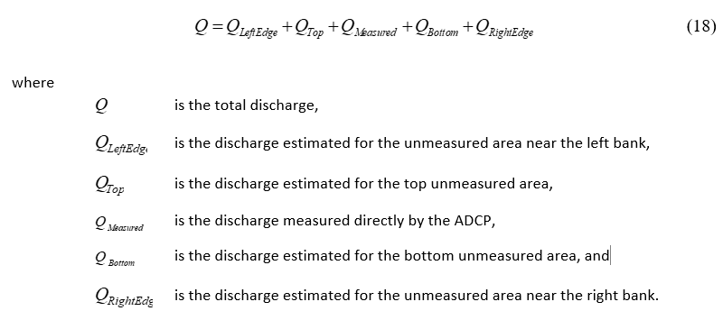

The general equations used to compute the measured and unmeasured portions 
of the cross-section are well documented (Simpson and Oltmann, 1993; 
Mueller and others, 2013; Teledyne
RD Instruments, 2014; SonTek, 2003) and are mostly consistent among the 
manufacturers;
therefore, only a brief summary is provided herein.

### Measured Discharge
The measured discharge is computed using the cross product of the water and boat velocities.
The equation for discharge in each depth cell, bin Q , can be written in terms of the water- and boatvelocity
vector components as follows:

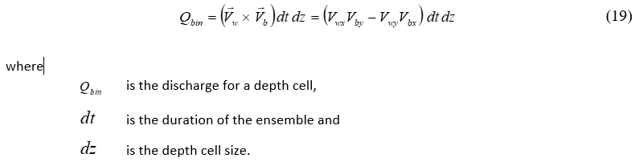

The measured portion of the discharge can then be computed as follows:

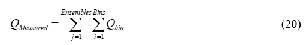

Because QRev interpolates invalid depth, boat velocity, and water velocities, all of the necessary
data are available to apply equation 19.

### Top Discharge
The top discharge is computed using the selected top extrapolation method—constant,
power, or three-point fit. The extrapolation method for computing the top discharge can be
applied to the individual velocity components (approach used by SonTek) or to the cross product
from equation 19 (approach used by TRDI). Both approaches are mathematically identical. QRev
uses the cross product; therefore, only the equations associated with that approach are presented
herein.

#### Constant
The simplest assumption for estimating the top discharge is to assume that the velocity
(cross product) in the topmost valid depth cell is a good estimate of the mean velocity between
that depth cell and the water surface. This method is typically referred to as the constant
extrapolation method as follows:

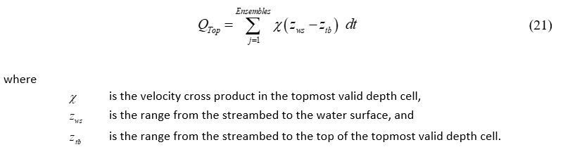

This constant extrapolation method is often used where an upstream wind or an irregular
velocity profile exists through the measured portion of the water column.

#### Power
The power fit is based on the power law (Chen, 1989). The power-law equation is
represented in terms of the cross product as follows:

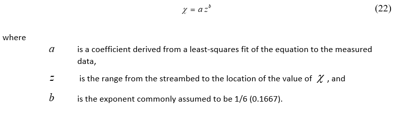

Although 0.1667 is the default exponent for the power law, the exponent should be adjusted to fit
the measured data as discussed in the “Extrapolation Methods” section of this report. The powerlaw
equation is then integrated over the range from the water surface to the top of the uppermost
depth cell with valid water velocities as follows:

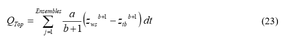

#### Three-Point Fit
QRev uses the TRDI implementation of the three-point fit method for the top
extrapolation. This method uses the top three bins to estimate a slope, and this slope is then
applied from the top bin to the water surface. A constant value or slope of zero is assumed if less
than six bins are present in the profile (Teledyne RD Instruments, 2014).

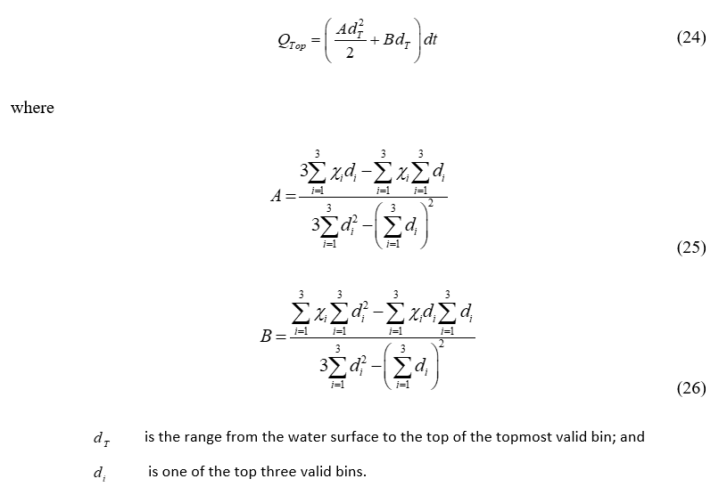

### Bottom Discharge
ADCPs cannot measure the water velocity near the streambed because of side-lobe
interference. Unlike the top discharge estimation problem where the velocity at the water surface
is not known, the water velocity at the streambed is somewhat known. Fluid mechanics theory
indicates the water velocity must go to zero at the streambed and that a logarithmic velocity
profile is a reasonable approximation of the velocity profile in the boundary layer (Schlichting,
1979). Therefore, the power law is always used to compute the discharge in the bottom
unmeasured portion of the water column as follows:

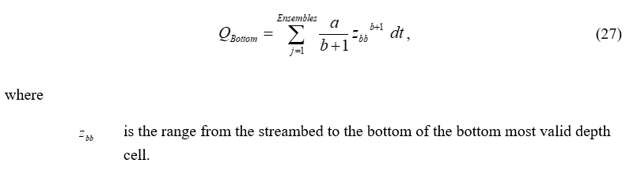

To better apply this method to situations where the profile throughout the water column
may not follow a logarithmic distribution, such as for bidirectional flow, a no slip method is
used. The no slip method applies equation 27 but restricts the least-squares determination of a
to depth cells in the bottom 20 percent of the profile, or in the absence of valid depth cells in the
bottom 20 percent, the last valid depth cell is used to compute a .

### Edge Discharge
The unmeasured discharge at the edges of the stream is estimated using a ratio
interpolation method documented by Fulford and Sauer (1986), which can be used to estimate a
velocity at an unmeasured location between the riverbank and the first or last measured velocity
in a cross-section. The equation for the estimate is as follows:

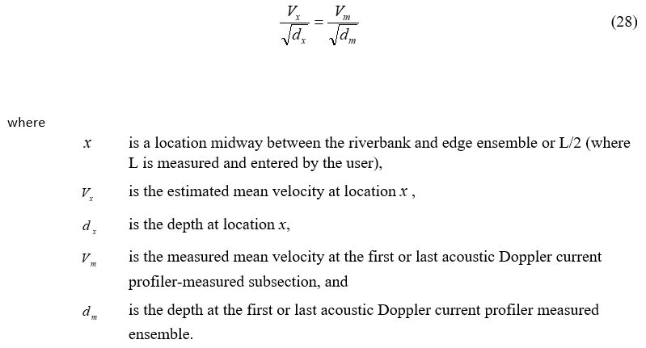

Fulford and Sauer (1986) defined dm and Vm as depth and velocity, 
respectively, at the
center of the first or last measured subsection and not the near-shore edge of the ensemble, as
presented in equation 28. However, because the ADCP ensembles purposely are kept narrow at
the start and finish of each measurement, the differences between the two applications are not
significant (Simpson and Oltmann, 1993). With the Fulford and Sauer (1986) method, discharge
can be estimated by assuming a triangular area at the edge as follows:

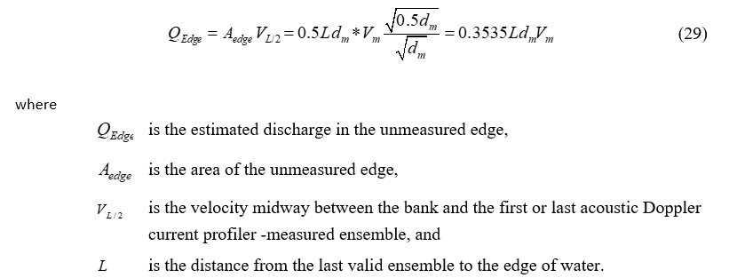

Equation 29 can be written in a more general form, which uses an edge-shape coefficient, as
follows:

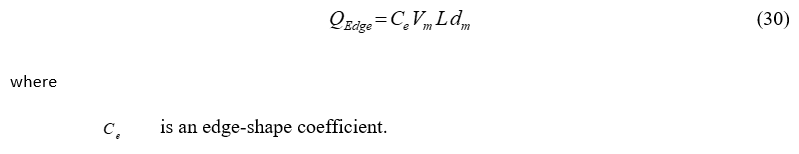

The edge-shape coefficient is a function of the shape, roughness, and velocity distribution
in the unmeasured edge. For triangular edges, the coefficient is commonly set to 0.3535. Oberg
and Schmidt (1994) used 0.91 for rectangular edges, and 0.91 is the default value for rectangular
edges used in WinRiver II (Teledyne RD Instruments, 2014). SonTek (2003) 
used data from Rantz and others (1982) to develop an equation for the rectangular edge coefficient based on the
ratio of / m L d as follows:

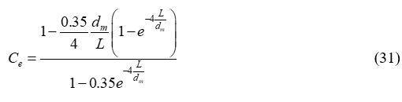

Investigation into the development of equation 31 by SonTek resulted in a third
alternative for the rectangular edge coefficient but also provided some information on sensitivity
associated with computing the rectangular edge coefficient. The proposed rectangular edge
coefficients refer to a set of laboratory data (table 5) that do not have a reliable reference. Rantz
and others (1982) indicated that “Laboratory data suggest …” and provide no reference. Khan
and others (1997) present the same data and provide a reference to Hagan (1989). Hagan (1989)
was not readily available. SonTek fit these data with the following equation:

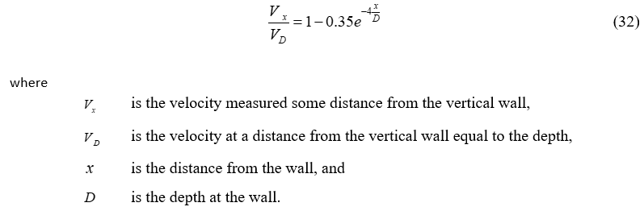

SonTek’s fit attempts to maintain a value of 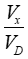
near 1 for values of 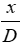 greater than or equal to
1. Because the available data do not extend beyond 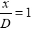, the proper behavior is unknown.
Integrating equation 33 and manipulation of the equation to compute the edge discharge results
in a rectangular edge coefficient defined by equation 34 as follows:

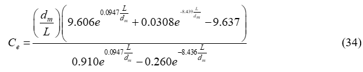

**Table 5.** Laboratory data on velocity near vertical walls (Rantz and others,
1982).
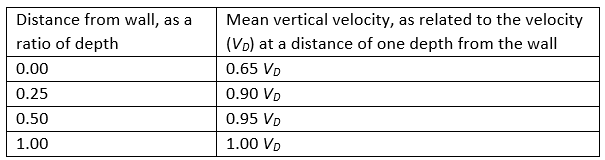

The rectangular edge coefficient options for values of 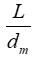 from 0 to 2 are 
compared in figure 5.
Given that the range of variation in the edge coefficient is about +/- 0.02 
for values of  typically experienced in 
the field and the actual roughness of the vertical wall and bed is
unknown, QRev defaults to 0.91 for simplicity and until additional research is completed and a
more accurate approach is documented.

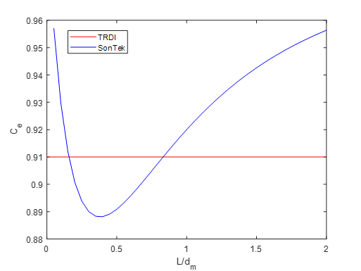
**Figure 5.** Comparison of proposed rectangular edge coefficients.

The value for L must be measured and entered by the user. To obtain a good
measurement for Vm, at least 10 ensembles of valid data also are recommended to be collected in
a near-stationary position at the beginning and end of each transect. QRev follows WinRiver II
procedures for data collected with WinRiver II; the first or last 10 valid ensembles are used. For
data collected with RiverSurveyor Live, QRev honors the RiverSurveyor Live designation of
edge ensembles and if none of the edge ensembles are valid, a zero discharge is computed for the
edge. The user is presented a warning in such cases and can manually adjust the number of edge
ensembles.

### Discharge for Invalid Data
The discharge for ensembles with invalid data is computed from the interpolated values
of boat velocity, depth, and water velocity. By interpolating these basic variables, the discharge
is computed rather than interpolated. Boat velocity, depth, and water velocity are never
extrapolated. Thus, ensembles at the beginning or end of a transect with invalid boat velocity,
depth, or water velocity data will have a zero discharge.

Discharge is interpolated for ensembles where the depth is too shallow for a valid depth
cell. The computation is done using interpolation of unit discharge defined as the ensemble
discharge divided by the depth of the ensemble and the duration of the ensemble. The
independent variable for the interpolation is the track distance. After interpolation the
discharge for the interpolated ensembles is computed by multiplying the interpolated value by
the depth and duration of those ensembles to achieve discharge for those ensembles.

## Measurement Quality Assessment
The person making the discharge measurement is concerned with the quality 
of the data being collected. QRev assists the user by automatically 
checking many quality indicators and providing color coded, symbol coded, 
and textual feedback on the results of the automated quality checks. Some 
of the checks enforce USGS policy associated with using ADCP’s for 
moving-boat streamflow measurements, and other checks help identify 
potential issues with the collected data.

If the depth of an ensemble is too shallow such that there are no depth 
cells above the side lobe cutoff, QRev computes discharge for these 
ensembles by interpolating the unit discharge. The unit discharge is 
computed by dividing the ensemble discharge by the depth of the ensemble 
and the duration of the ensemble. The independent variable for the 
interpolation is the track distance. After interpolation, the discharge for 
the interpolated ensembles is computed by multiplying the interpolated 
value by the depth and duration of those ensembles to achieve discharge for 
those ensembles.

### Transects
The USGS policy is that a measurement be comprised of at least one pair of 
reciprocal transects (two transects) and that the combined duration of all 
transects be at least 720 seconds (Mueller and others, 2013). A single 
transect may be considered a measurement in situations with rapidly varying 
flow or for some tidal measurements. QRev checks for consistency with USGS 
policy and provides guidance where the combination of transects may not be 
optimal. Typically, all transects in a measurement should have the same 
sign (positive or negative), except in rare circumstances. Generally, a 
change in sign is due to user error in assigning the correct start bank. 
The uncertainty of measurements with only two transects can often be 
reduced by collecting additional transects. QRev checks for these 
situations and provides the user feedback as shown in Table 6.

**Table 6.** Transect quality checks and messages.
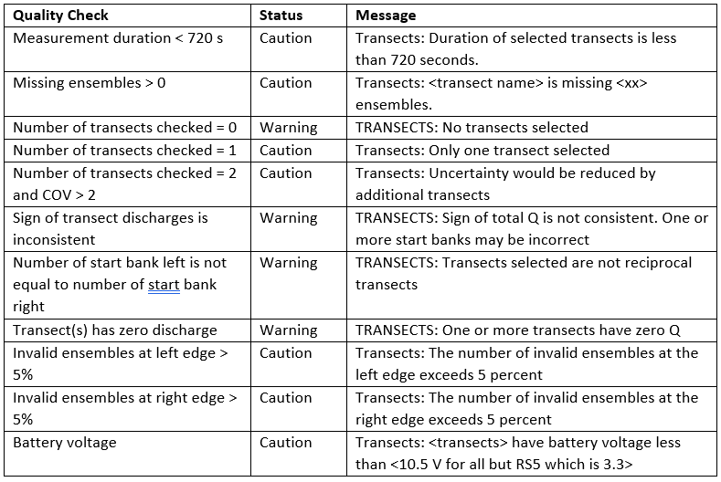

### System Test
The USGS policy is that a system test be completed prior to making a 
discharge measurement with an ADCP (Mueller and others, 2013). System test 
results for TRDI ADCPs are typically stored in the*.mmt file and for SonTek 
ADCPs are stored in the SystemTest folder. If the test results are in these 
locations, QRev will automatically load the results. However, if results of 
a system test are stored elsewhere, the user can manually load the file. 
Results from multiple system tests can be loaded. The results will be 
identified by date and time, or if loaded manually, the results will be identified by filename.

A system test is a series of different tests for various aspects of the ADCP. A complete series of discrete tests is referred to as a “system test”, and a single test within that series is referred to as a “discrete test”. QRev automatically scans the results, reports the number of failed tests, and provides feedback to the user by coloring the system test button and providing messages as shown in Table 7.
**Table 7.** System test quality checks and messages.
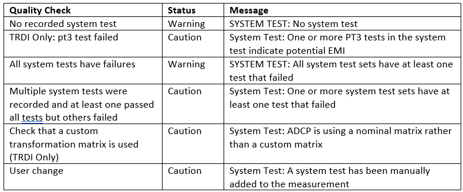

### Compass, Pitch, and Roll
Most ADCPs contain an internal compass and procedures for calibrating the 
compass. In addition, some ADCPs have procedures for evaluating the compass 
after an initial calibration. A compass calibration is required if a loop 
moving-bed test is used or if the boat velocity is referenced to GGA or VTG.
If the boat velocity is referenced to bottom track and a stationary 
moving-bed test is used, the compass will have no effect on the resulting 
discharge. However, a compass calibration is still encouraged so that the 
direction of the velocity data will be correct for any use of the data 
other than discharge. In addition, the pitch and roll of the ADCP can 
affect the accuracy of the compass heading and the measured depth and 
velocity. The quality checks for the compass, pitch, and roll sensors are 
shown in Table 8.

### Water Temperature Validation
The accuracy of discharge measurements made with an ADCP is dependent on an 
accurate speed of sound, which is dependent on an accurate water 
temperature. The USGS policy is that an independent water temperature be 
collected and compared to the ADCP’s reported water temperature for each 
measurement. WinRiver II allows the user to enter this independent water 
temperature, and QRev will read that value from the *.mmt file and 
automatically populate that value in QRev. When using SonTek ADCPs with 
QRev, the user must manually enter the independent water temperature in 
QRev. QRev compares the independent water temperature to a user entered 
ADCP reading or the mean ADCP water temperature for the whole measurement. 
Consistent with USGS policy, if the difference in temperatures exceed 2 
degrees Celsius, a warning is issued.

**Table 8.** Compass, pitch, and roll quality checks and messages.
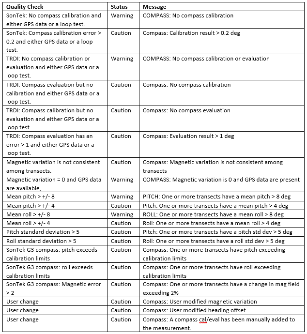

QRev also evaluates the change in ADCP measured water temperature for the duration of the measurement. At some sites, the water temperature may change during the measurement or spatially in the cross section. However, a change in measured water temperature during a measurement is often indicative of the ADCP not being given sufficient time to equilibrate to the water temperature. In this situation, the ADCP is measuring the wrong water temperature and, thus, using the wrong speed of sound. Checks used to assess water temperature and the feedback messages are shown in Table 9.

**Table 9.** Temperature quality checks and messages.
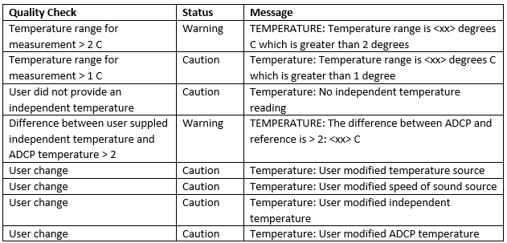

### Moving-Bed Tests
The USGS policy requires a moving-bed test to be completed for every ADCP 
moving-boat discharge measurement (Mueller and others, 2013). A loop or 
stationary moving-bed test method can be used. The quality assessment of 
moving-bed tests is done in the following three steps: 
1) detailed evaluation of each moving-bed test
2) selection of the moving-bed test(s) to be used
3) general quality assessment using the selected test(s). 

The detailed evaluation step evaluates the actual moving-bed test based on 
specific criteria for loop or stationary tests. Based on the results of 
that detailed evaluation, QRev selects the moving-bed test(s) to use to 
determine if a moving bed exists and applies any necessary corrections. The 
general quality assessment step is completed on the results of the selected 
moving-bed test and provides the color coded and textual feedback to the 
user in the main QRev window.

The evaluation for loop tests uses the same criteria and algorithms used in 
the computer program LC (Mueller and others, 2013) and gives the loop 
moving-bed test a quality rating of good, warnings, or errors. The specific 
quality checks and messages (Table 10) related to each loop moving-bed test 
are displayed in the moving-bed messages but not in the main tab. If an 
error exists, the loop test is not valid, and the moving-bed condition 
remains unknown. After the loop moving-bed test is evaluated, the status of 
a moving-bed is determined based on the checks that resulting messages 
shown in Table 11.

If GPS data are available, the user will be provided the option to use GPS 
as the reference against which the bottom track will be compared instead of 
assuming a fixed boat location for stationary tests or returning to the 
exact starting location for the loop test. NOTE: This setting is on the 
MovBedTst tab and is not related to the Nav Reference setting for computing 
discharge. For GPS reference, the closure distance and direction are 
magnitude and direction of the vector from the end of the GPS track and the 
end of the bottom track. This closure error is automatically computed if 
GPS data are available and is used to quality check the consistency of 
between the moving-bed tests using only bottom track and the same tests 
reference to GPS. If GGA data are available it will be used, if not VTG 
data will be used. Depending on the movement of the boat the magnetic 
variation could have substantial impact on the results using GPS. The 
magnetic variation, heading offset, and heading source can be changed by 
changing them on the Compass P/R tab and applying to all transects.

**Table 10.** Loop moving-bed test quality checks and messages.
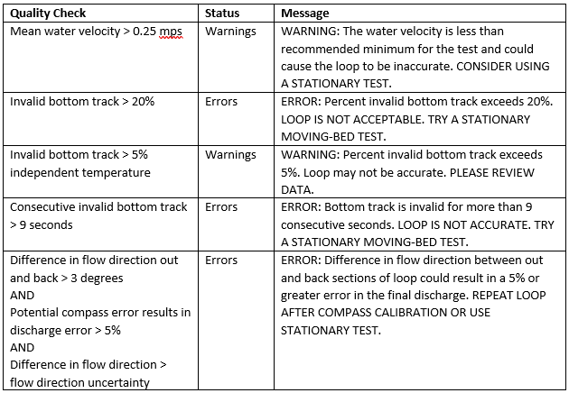

**Table 11.** Loop moving-bed test moving-bed determination checks and 
messages.
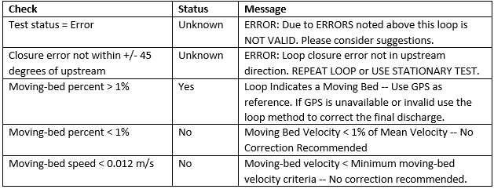

Unlike WinRiver II, RiverSurveyor Live, or SMBA, QRev evaluates the quality of individual stationary moving-bed tests. The evaluation examines the percentage of ensembles with invalid bottom track velocities, the duration of the test, and if the test appears to have reached equilibrium. Data with invalid bottom track are excluded from the stationary test. The logic for the evaluation of stationary moving-bed test is provided in Tables 12 and 13.

**Table 12.** Stationary moving-bed test quality checks and messages.
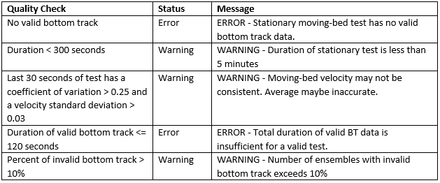

**Table 13.** Stationary moving-bed test moving-bed determination.
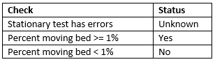

If more than one loop test or a loop test(s) and stationary test(s) are 
completed, QRev must decide which test(s) should be selected to determine 
if a moving bed exists and compute any required moving-bed corrections. If 
more than one valid loop test exits, the last valid loop test is selected. 
If no valid loop tests exist, all valid stationary tests are selected. If 
any of the selected tests indicate a moving bed, a moving-bed condition 
exists, and the selected test(s) is used to correct the bottom track 
referenced discharge.

The general quality assessment uses the selected moving-bed test to set the tab color and symbol and provide messages to the user. The quality checks and messages for moving-bed tests are shown in Table 14.

### User Input
QRev checks that a station name and station number have been entered. If 
the station name and number are entered in WinRiver II, QRev will read and 
use those values. The Matlab output from SonTek does not provide a station 
name and number; therefore, for SonTek ADCPs, the user must enter the 
station name and number manually in QRev.

### Measured Discharge Variables
The measured discharge variables are boat velocity, depth, and water 
velocity. For each of these variables, the ensembles with invalid data are 
identified and the discharge is computed for those invalid ensembles based 
on the interpolated data determined. The quality assessment is based on the 
following three characteristics: (1) the total discharge interpolated, (2) 
the maximum discharge interpolated for a continuous segment of invalid data,
and (3) the total number of invalid ensembles. The quality checks and 
resulting messages are provided in Tables 15-16.

**Table 14.** Moving-bed test quality checks and messages.
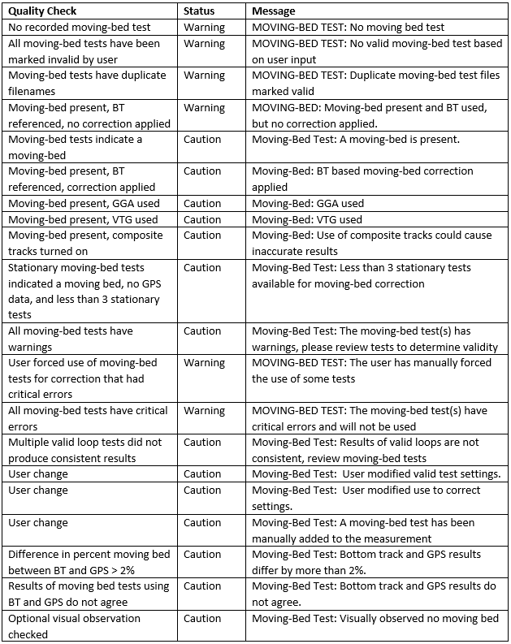

**Table 15.** Summary of quality assessment messages for boat velocity. 
[<ref>: bt, gga, or vtg; <REF> BT, GGA, VTG]
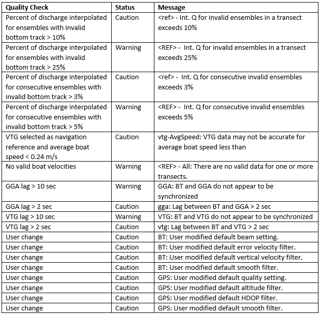

**Table 16.** Summary of quality assessment messages for depth.
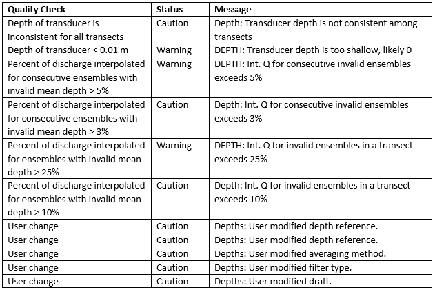

**Table 17.** Summary of quality assessment messages for water velocity.
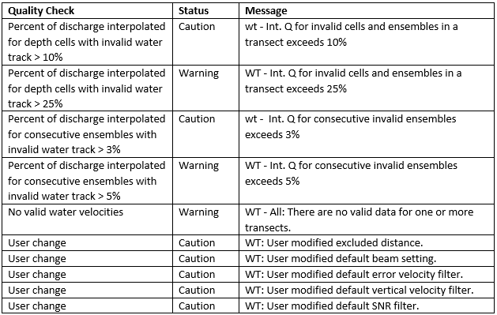

### Extrapolation
The quality of the extrapolation is based on the extrapolation uncertainty 
(see “Uncertainty Computation” section for details on estimating the 
extrapolation uncertainty). The quality checks and resulting messages are 
provided in Table 18.

**Table 18.** Extrapolation Quality Checks
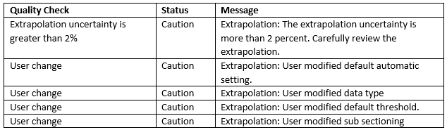

### Edges
The quality assessment of edges is a combination of USGS policy, 
reasonableness of edge estimates, and consistency. The USGS policy requires 
supporting documentation or data for any edge estimate that exceeds 5 
percent of the total discharge (Mueller and others, 2013). In addition, 
edges should not have a zero discharge and the edge type and sign 
(direction) should be consistent. The logic for assessing the quality of 
the edges is provided in Table 19.

## Uncertainty Computation
Computing the uncertainty of an ADCP moving-boat discharge measurement is a complex task. Although many researchers have proposed approaches to determining the uncertainty of an ADCP moving-boat discharge measurement, an uncertainty model that has been generally accepted and that can be applied to actual field measurements does not exist. QRev provides two options for estimating the uncertainty of a measurement:
1. original QRev model (QRev-UA) based on simple assumptions of what are likely the largest error sources, and
2. OURSIN model based on the framework of the Guide to the expression of Uncertainty in Measurement (GUM).

**Table 19.** Edge discharge quality checks and messages.
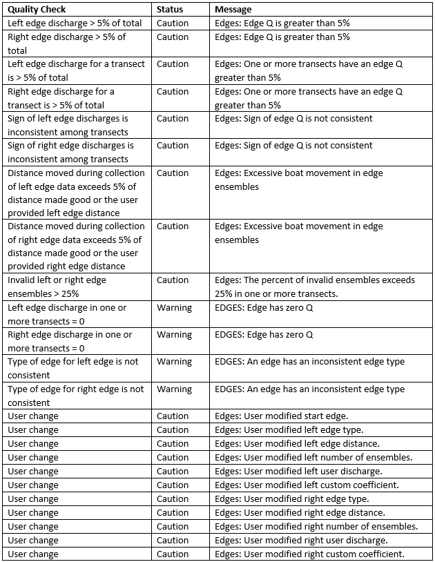

### QRev-UA
The approach used in QRev-UA is neither detailed nor comprehensive but is presented as a guide to the user in rating the measurement. QRev assesses the uncertainty based on the following six categories:
1. random,
2. invalid data,
3. edge discharge,
4. moving bed,
5. extrapolation,
6. systematic.

The approach used to assign the uncertainty to each of these categories is discussed in the following sections.

#### Random Uncertainty
The 95 percent random uncertainty expands the discharge coefficient of variation (QCOV) to a 95 percent level by applying a coverage factor from the Student’s t-distribution based on the number or degrees of freedom and then dividing by the square root of the number of transects. When only two transects comprise a measurement, the theoretical Student’s t approach is abandoned and the 95 percent uncertainty is computed as the QCOV * 3.3.

#### Invalid Data Uncertainty
The 95 percent uncertainty for invalid data is assumed to be 20 percent of the percent discharge for invalid cells and ensembles.

#### Edge Discharge Uncertainty
The 95 percent uncertainty for the edge discharge is assumed to be 30 percent of the total discharge in the edges. This uncertainty accounts for uncertainty in the edge shape, roughness, distance to shore, depth, and velocity.
#### Extrapolation Uncertainty
The percent extrapolation uncertainty is determined by computing the percent difference in discharge from the selected extrapolation method to other possible extrapolation methods and averaging the best four options. The following is a list of the possible extrapolation methods:
1. top power, bottom power, 1/6th exponent;
2. top power, bottom power, optimized exponent;
3. top constant, bottom no slip, 1/6th exponent;
4. top constant, bottom no slip, optimized exponent;
5. top three point, bottom no slip, 1/6th exponent;
6. top three point, bottom no slip, optimized exponent; and
7. optional manually specified method.

#### Moving-Bed Test Uncertainty
If bottom track is not the navigation reference, the percent moving-bed test uncertainty is set to zero. If bottom track is used and a moving-bed test is valid, the percent moving-bed test uncertainty is set to 1 percent if the test indicates no moving bed is present and to 1.5 percent if a moving bed is present. If the moving-bed test is invalid or not completed, the uncertainty is set to 3 percent.

#### Systematic Uncertainty
Systematic uncertainty is assumed to be 1.5 percent at one standard deviation.

#### Estimated 95 Percent Uncertainty
The standard approach to computing the 95 percent uncertainty is to compute the square root of the sum of the squares of the standard deviations of the various sources of uncertainty (assuming independence) and then multiply by two to get a 95 percent value (Joint Committee for Guides in Metrology, 2008). So that the random uncertainty receives the proper coverage factor for the number of transects, each of the categories is estimated at the 95 percent level. The values are then each divided by two before taking the square root of the sum of the squares. Finally, the result is multiplied by two to achieve a 95 percent uncertainty for the measurement. The final value should not be viewed as strictly quantitative but more as a qualitative guide. The algorithms for the various sources of uncertainty are based on approximations and simple assumptions.

#### User Override
QRev allows the user to override the automatic uncertainty values by entering a different value. The user value for that category will then be used to compute the final uncertainty.

### OURSIN
OURSIN was first developed by Dramais (2011) and then extended and 
implemented into software (Naudet et al, 2019) for computing the 
uncertainty of measurements acquired with Teledyne RDI ADCPs. OURSIN has 
been further extended (Despax, 2021) and implement as an option in QRev. 
The OURSIN method follows the main steps proposed by the GUM (JCGM, 2008). The list of error sources are summarized in Table 20.

**Table 20.** List of error sources in ADCP discharge measurements covered by 
the OURSIN method, with their nature (type A or B, Bias, Random or Both) and the method used for their quantification).
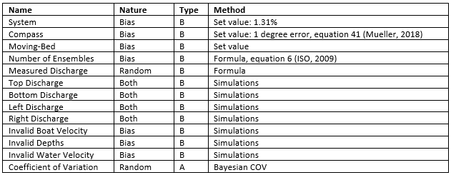

#### System
The discharge uncertainty due to systematic errors (𝑢𝑠𝑦𝑠) accounts for all the residual errors that remain after the ADCP calibration. It is representative of the minimum uncertainty of an ADCP discharge measurement under ideal conditions. Using data from Oberg and Mueller (2007) and Naudet et al. (2019) a systematic uncertainty of 1.31% was estimated for bottom track referenced discharge measurements. This same value is used for GPS referenced discharge measurements.

#### Compass
The potential bias in the discharge due to dynamic compass errors (𝑢𝑐𝑜𝑚𝑝𝑎𝑠𝑠)
when GPS (GGA or VTG) is used as the navigation reference is computed using 
equation 41 from Mueller (2018) assuming a heading error of 1 degree. The 
user can change this assumption in the Advanced Settings tab. The compass 
uncertainty is zero when bottom track is used as the navigation reference.

#### Moving-Bed
The moving-bed uncertainty (𝑢𝑚𝑏) uses the same assumptions as the original 
QRev-UA. If bottom track is used and a moving-bed test is valid, the moving-bed uncertainty is 0.5 percent if the test indicates no moving bed is present and to 0.75 percent if a moving bed is present. If the moving-bed test is invalid or not completed, the uncertainty is set to 1.5 percent. If bottom track is not the navigation reference, the percent moving-bed test uncertainty is set to zero.

#### Number of Ensembles
The uncertainty due to a limited number of ensembles is computed using the equation proposed by Le Coz et al. (2012) as an approximation of the tabulated values proposed by ISO (2009).

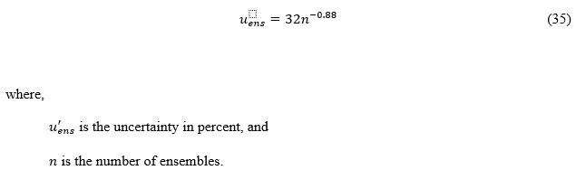

#### Measured Discharge
The measured discharge is that portion of the discharge that is measured in 
valid depth cells and does not include any of the extrapolated areas (top, 
bottom, left edge, or right edge). It is the combination of the random 
uncertainties of the boat velocity, water-track velocity, and the depth 
cell size(s). The uncertainty of the bottom-track and water-track 
velocities are estimated using the fact that the standard deviation of the 
scaled error velocities (equation 4) is equivalent to the standard 
deviation of the horizontal velocities (Mueller et al., 2013).

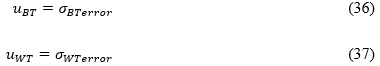

If GGA is used as the boat velocity reference, the elevation and serial time associated with that elevation as reported in the GGA sentence and assigned to each ensemble is used to estimate the uncertainty. The uncertainty of the boat velocity is computed as 1/3rd of the standard deviation of the elevations divided by the mean difference in serial time.

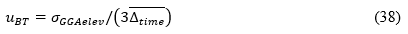

If VTG is used as the boat velocity reference, there is not a similar approach that can be used. The uncertainty for VTG referenced boat velocities is assumed to be 0.5 m/s based on review of several GPS manufactures specifications.

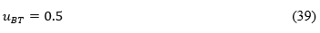

Both the GGA and VTG uncertainties can be changed by the user in the Advanced Settings tab. The uncertainty of the depth cell size due to variations in the speed of sound through the water column is assumed to 0.5% and can be adjusted by the user in the Advanced Settings tab. The uncertainty of the measured portion of the discharge for a transect is computed as,

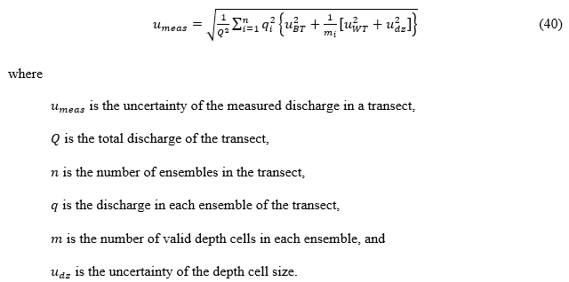

#### Top Discharge
The uncertainty of the top discharge is estimated by assuming a rectangular distribution. The limits of the distribution are determined from 10 different simulations.
1. Selected – top discharge using selected extrapolation.
2. Power / Power Optimized – top discharge using power / power fit with optimize exponent.
3. Power / Power Minimum – top discharge using power / power fit and the lower 95% confidence limit for the exponent.
4. Power / Power Maximum – top discharge using power / power fit and the upper 95% confidence limit for the exponent.
5. Constant / No Slip Optimized – top discharge using constant / no slip fit with optimize no slip exponent.
6. Constant / No Slip Minimum – top discharge using constant / no slip fit and the lower 95% confidence limit for the no slip exponent.
7. Constant / No Slip Maximum – top discharge using constant / no slip fit and the upper 95% confidence limit for the no slip exponent.
8. 3-Point / No Slip Optimized – top discharge using 3-point / no slip fit with optimized no slip exponent.
9. Selected with Maximum Draft – top discharge using the selected fit with the draft increased by the specified draft uncertainty.
10. Selected with Minimum Draft – top discharge using the selected fit with the draft decreased by the specified draft uncertainty.

The draft uncertainty is assumed to be 0.02 m if the 90th percentile of the depth is < 2.5 m, otherwise the uncertainty is assumed to be 0.05 m unless another value is specified by the user.

The maximum and minimum discharges from the simulations are assumed to be the limits of the rectangular distribution.

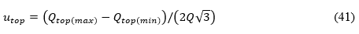

#### Bottom Discharge
The uncertainty of the bottom discharge is estimated by assuming a rectangular distribution. The limits of the distribution are determined from 8 different simulations.
1. Selected – bottom discharge using selected extrapolation.
2. Power / Power Optimized – bottom discharge using power / power fit with optimize exponent.
3. Power / Power Minimum – bottom discharge using power / power fit and the lower 95% confidence limit for the exponent.
4. Power / Power Maximum – bottom discharge using power / power fit and the upper 95% confidence limit for the exponent.
5. Constant / No Slip Optimized – bottom discharge using constant / no slip fit with optimize no slip exponent.
6. Constant / No Slip Minimum – bottom discharge using constant / no slip fit and the lower 95% confidence limit for the no slip exponent.
7. Constant / No Slip Maximum – bottom discharge using constant / no slip fit and the upper 95% confidence limit for the no slip exponent.
8. 3-Point / No Slip Optimized – bottom discharge using 3-point / no slip fit with optimized no slip exponent.

The maximum and minimum discharges from the simulations are assumed to be the limits of the rectangular distribution.

#### Left Discharge
The uncertainty of the left edge discharge is estimated by assuming a rectangular distribution. The limits of the distribution are determined from 5 different simulations.
1. Selected – left edge discharge using the selected settings.
2. Edge Minimum – left edge discharge assuming a triangular shape with the left edge distance decreased by the specified distance uncertainty.
3. Edge Maximum – left edge discharge assuming a rectangular shape with the left edge distance increased by the specified distance uncertainty.
4. Draft Minimum – left edge discharge using the selected settings with the draft decreased by the specified draft uncertainty.
5. Draft Maximum – left edge discharge using the selected settings with the draft increased by the specified draft uncertainty.

The left distance uncertainty is assumed to be 20% of the distance unless another value is specified by the user. The minimum left distance cannot be less than 10 cm. The draft uncertainty is assumed to be 0.02 m if the 90th percentile of the depth is < 2.5 m, otherwise the uncertainty is assumed to be 0.05 m unless another value is specified by the user.

The maximum and minimum discharges from the simulations are assumed to be the limits of the rectangular distribution.

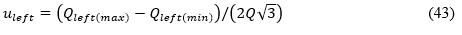

#### Right Discharge
The uncertainty of the right edge discharge is estimated by assuming a rectangular distribution. The limits of the distribution are determined from 5 different simulations.
1. Selected – right edge discharge using the selected settings.
2. Edge Minimum – right edge discharge assuming a triangular shape with the right edge distance decreased by the specified distance uncertainty.
3. Edge Maximum – right edge discharge assuming a rectangular shape with the right edge distance increased by the specified distance uncertainty.
4. Draft Minimum – right edge discharge using the selected settings with the draft decreased by the specified draft uncertainty.
5. Draft Maximum – right edge discharge using the selected settings with the draft increased by the specified draft uncertainty.

The right distance uncertainty is assumed to be 20% of the distance unless another value is specified by the user. The minimum right distance cannot be less than 10 cm. The draft uncertainty is assumed to be 0.02 m if the 90th percentile of the depth is < 2.5 m, otherwise the uncertainty is assumed to be 0.05 m unless another value is specified by the user.

The maximum and minimum discharges from the simulations are assumed to be the limits of the rectangular distribution.

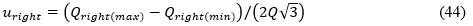

#### Invalid Boat Velocity
The uncertainty of the discharge due to invalid boat velocities is estimated by assuming a rectangular distribution. The limits of the distribution are determined from 3 different simulations.
1. Liner Interpolation – The discharge is computed by estimating the invalid 
boat velocities using linear interpolation.
2. Previous Valid – The discharge is computed by estimating the invalid boat velocities using the previously valid boat velocity.
3. Next Valid – The discharge is computed by estimating the invalid boat velocities using the next valid boat velocity.

The maximum and minimum discharges from the simulations are assumed to be the limits of the rectangular distribution.

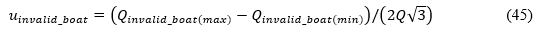

#### Invalid Depths
The uncertainty of the discharge due to invalid depths is estimated by assuming a rectangular distribution. The limits of the distribution are determined from 3 different simulations.
1. Liner Interpolation – The discharge is computed by estimating the invalid 
depths using linear interpolation.
2. Previous Valid – The discharge is computed by estimating the invalid depths using the previously valid depth.
3. Next Valid – The discharge is computed by estimating the invalid depths using the next valid depths.

The maximum and minimum discharges from the simulations are assumed to be the limits of the rectangular distribution.
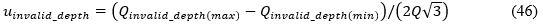

#### Invalid Water Velocities
The uncertainty of the discharge due to invalid water velocities is estimated by assuming a rectangular distribution. The limits of the distribution are determined from 7 different simulations.
1. ABBA – Measured discharge with invalid water velocity estimated using ABBA 
interpolation (for details see Water Track, Interpolation section).
2. TRDI – Measured discharge with invalid water velocity estimated using TRDI interpolation (for details see Computing Discharge from Invalid Data section).
3. Adjacent Above – Measured discharge with invalid water velocity estimated using the water velocity from the nearest valid depth cell above the invalid cell.
4. Adjacent Below – Measured discharge with invalid water velocity estimated using the water velocity from the nearest valid depth cell below the invalid cell.
5. Adjacent Before – Measured discharge with invalid water velocity estimated using the water velocity from the nearest valid depth cell at a similar normalized depth from the previous ensembles.
6. Adjacent After – Measured discharge with invalid water velocity estimated using the water velocity from the nearest valid depth cell at a similar normalized depth from the following ensembles.
7. Shallow Water – Measured discharge with no interpolation for ensembles that have no valid depth cells due to shallow depth (for details see Discharge Computation, Discharge for Invalid Data section).

The maximum and minimum discharges from the simulations are assumed to be the limits of the rectangular distribution.
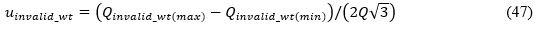

#### Coefficient of Variation
The coefficient of variation (𝑢𝑐𝑜𝑣) is computed using a Bayesian approach. The Bayesian approach to the coefficient of variation combines information from the transects comprising the measurement and a prior estimation of the coefficient of variation. The use of a prior estimate provides a way to estimate the coefficient of variation when only 1 or 2 transects comprise the measurement. The prior estimation of the coefficient of variation is set to 3% with an uncertainty of 20%. Both values can be changed by the user in the Advanced Setting tab, but the user cannot directly set the coefficient of variation in the Data table. The coefficient of variation computed for the measurement is used for each transect to compute the total uncertainty associated with each transect. For details on the Bayesian coefficient of variation the readers is referred to Despax et al. (2021).

#### Total 95% Uncertainty
The total 95% uncertainty for transect (𝑈𝑇) is computed as,

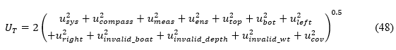

The total 95% uncertainty for the measurement (𝑈𝑀) is computed by estimating the bias terms for the measurement as the mean of those terms for the transects.

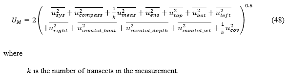

The QRev allows the user to directly specify any of the uncertainties for the measurement except the coefficient of variation. If the user specifies an uncertainty it is applied to all transects and the uncertainty is shown as a User 95% Uncertainty and the Automatic 95% Uncertainty remains unchanged. Additionally, the user can override the default assumptions used in the computations using the table in the Advanced Settings tab. User changes in the Advance Setting tab are applied to the Automatic 95% Uncertainty for both the transects and measurement.

## Data File Formats
QRev imports data from TRDI WinRiver II and SonTek RiverSurveyor Live. QRev can read the raw data files (*.mmt and *.pd0) produced by WinRiver II for all TRDI ADCPs. The raw data format for SonTek *.riv and *.rivr files is not available; therefore, QRev can only use the *.mat files produced by RiverSurveyor Live and RSQ. Versions of RiverSurveyor Live prior to version 3.81 produced *.mat files that cannot be read by Matlab versions 2014 or later.
QRev’s internal data storage format is documented in the source code. The data can be saved in a Matlab file, which QRev can read for future review or processing. With the exception of using Python naming and formatting conventions, QRev 4.xx internal data storage format is similar to the Matlab output format defined in Appendix 2. This format maintains the original data. The data are processed and then stored in a standardized format so that computational and filtering algorithms can be independent of the ADCP used to collect the data.
QRev also produces an XML output file that can be used to import QRev processed results into the USGS SVMAQ software or other agency databases. The XML format is defined in appendix 3.
Summary and Need for Further Development
Summary and Need for Further Development
QRev provides common and consistent computational algorithms combined with automated filtering and quality assessment of the data that substantially improves the quality and efficiency of streamflow measurements and helps ensure that streamflow measurements are consistent, accurate, and independent of the manufacturer of the instrument used to make the measurement. QRev represents a substantial step towards standard processing algorithms and quality assessment that is instrument independent; however, there is a need for additional
87
research and development. This research and development should improve interpolation and filter algorithms, provide more complex quality assessments, improve and standardize methods for estimating the discharge in unmeasured areas, and provide a more robust approach to estimating the uncertainty of a measurement. In addition, the data structure used is QRev serves as a good starting point for developing a standard data format that would be common among all hydroacoustic instrumentation.
References
References
Chen, Cheng-Lung, 1989, Power law of flow resistance in open channels—Manning’s formula revisited: Proceedings of the International Conference on Channel Flow and Catchment Runoff, Centennial of Manning’s Formula and Kuichling’s Rational Formula, May 22–26, 1989, Charlottesville, Va., v. 8, p. 17–48.
Cleveland, W.S., 1979, Robust locally weighted regression and smoothing scatterplots: Journal of the American Statistical Association, v. 74, no. 368, p. 829–836, accessed April 6, 2016, at http://www.stat.washington.edu/courses/stat527/s13/readings/Cleveland_JASA_1979.pdf.
Cleveland, W.S., and Devlin, S.J., 1988, Locally weighted regression—An approach to Regression analysis by local fitting: Journal of the American Statistical Association v. 83, no. 403, p. 596–610, accessed April 6, 2016, at http://www.stat.washington.edu/courses/stat527/s13/readings/Cleveland_Delvin_JASA_1988.pdf.
Despax, A., Le Coz, J., Hauet, A., Mueller, D. S., Engel, F. L., Blanquart, B., . . . Oberg, K. A., 2019, Decomposition of uncertainty sources in acoustic Doppler current profiler streamflow measurements using repeated measures experiments. Water Resources Research.
Despax, A., Le Coz, J., Mueller, D.S., Naudet, G., Pierrefeu, G., Delamarre, K., Moore, S.A., and Jamieson, E.C., 2021, DRAFT, Empirical vs analytical methods for modeling the uncertainty of ADCP discharge measurements.
Fulford, J.M., and Sauer, V.B., 1986, Comparison of velocity interpolation methods for computing open-channel discharge, in Subitsky, S.Y., ed., Selected papers in the hydrologic sciences: U.S. Geological Survey Water-Supply Paper 2290, 154 p, accessed April 6, 2016 at http://pubs.usgs.gov/wsp/wsp2290/.
Hagan, Ross E., 1989, Measuring discharge with current meters: International Irrigation Center, Utah State University, Logan, Utah, 39 p.
88
Huang, H., 2018, Estimating uncertainty of streamflow measurements with moving boat acoustic Doppler current profilers. Hydrological Sciences Journal , 63 ,353-368.
ISO. (2009). ISO 748:2009 - Hydrometry 􀀀 measurement of liquid ow in open channels using current-meters or floats. (58 p.)
Joint Committee for Guides in Metrology, 2008, Evaluation of measurement data—Guide to the expression of uncertainty in measurement (GUM 1995 with minor corrections): Geneva, Switzerland.
Khan, M.A., Mahmood, K., and Skogerboe, G.V., 1997, Current meter discharge measurements for steady and unsteady flow conditions in irrigation channels: IWMI Pakistan Report T-007, International Irrigation Management Institute, Pakistan National Program.
Le Coz, J., Camenen, B., Peyrard, X., and Dramais, G., 2012, Uncertainty in open-channel discharges measured with the velocity-area method. Flow Measurement and Instrumentation, 26 , 18-29.
Le Coz, J., Blanquart, B., Pobanz, K., Dramais, G., Pierrefeu, G., Hauet, A., and Despax, A. (2016). Estimating the Uncertainty of Streamgauging Techniques Using In Situ Collaborative Interlaboratory Experiments. Journal of Hydraulic Engineering, 7 (142), 04016011.
Mueller, D.S., 2013, extrap—Software to assist the selection of extrapolation methods for moving-boat ADCP streamflow measurements: Computers & Geosciences, v. 54, p. 211–218, accessed April 6, 2016 at http://www.sciencedirect.com/science/article/pii/S009830041300037X.
Mueller, D.S., 2016, QRev—Software for computation and quality assurance of acoustic Doppler current profiler moving-boat streamflow measurements—User’s manual (ver.2.80): U.S. Geological Survey Open-File Report 2016–1052, 56 p.
Mueller, D.S., 2015, Velocity bias induced by flow patterns around ADCPs and associated deployment platforms– Proceedings of the IEEE/OES Eleventh Current, Waves and Turbulence Measurement Workshop, St. Petersburg, Fla., March 2–6, 2015: New York, IEEE, 7 p, accessed April 6, 2016 at http://ieeexplore.ieee.org/xpl/articleDetails.jsp?arnumber=7098103&filter%3DAND%28p_IS_Number%3A7098093%29.
Mueller, D. S., 2018, Assessment of acoustic doppler current profiler heading errors on water velocity and discharge measurements. Flow Measurement and Instrumentation, 64 , 224-233.
Mueller, D.S., Abad, J.D., García, C.M., Gartner, J.W., García, M.H., and Oberg, K.A., 2007, Errors in acoustic Doppler profiler velocity measurements caused by flow disturbance: Journal of Hydraulic Engineering, v. 133, no. 12, p. 1411–1420, accessed April 6, 2016 at http://ascelibrary.org/doi/abs/10.1061/%28ASCE%290733-9429%282007%29133%3A12%281411%29.
Mueller, D.S., Wagner, C.R., Rehmel, M.S., Oberg, K.A, and Rainville, Francois, 2013, Measuring discharge with acoustic Doppler current profilers from a moving boat: U.S.
89
Geological Survey Techniques and Methods, book 3, chap. A22, 95 p., http://dx.doi.org/10.3133/tm3A22.
National Marine Electronics Association, 2002, NMEA 0183—Standard for interfacing marine electronic devices, version 3.01: National Marine Electronics Association, 88 p, accessed April 6, 2016 at http://www.plaisance-pratique.com/IMG/pdf/NMEA0183-2.pdf.
Naudet, G., Pierrefeu, G., Berthet, T., Triol, T., Delamarre, K., and Blanquart, B., 2019, Oursin: Outil de repartition des incertitudes de mesure de debit par adcp mobile. La Houille Blanche(3-4), 93-101.
Oberg, K.A., and Schmidt, A.R., 1994, Measurements of leakage from Lake Michigan through three control structures near Chicago, Illinois, April–October 1993: U.S. Geological
Survey Water-Resources Investigations Report 94–4112, 48 p, accessed April 6, 2016 at https://pubs.er.usgs.gov/publication/wri944112.
Office of Surface Water, 2013, Policy on required minimum screening distance for the RiverSurveyor M9: U.S. Geological Survey, Office of Surface Water Technical Memorandum 2014.02, 6 p, accessed on, April 6, 2016, at http://water.usgs.gov/admin/memo/SW/sw1402.pdf.
Rantz, S.E., and others, 1982, Measurement and computation of streamflow—Volume 1, Measurement of stage and discharge: U.S. Geological Survey Water-Supply Paper 2175, 284 p, accessed April 6, 2016 at http://pubs.usgs.gov/wsp/wsp2175/.
Schlichting, H., 1979, Boundary layer theory (7th ed.): New York, McGraw-Hill.
Seo, I., and Baek, K., 2004, Estimation of the longitudinal dispersion coefficient using the velocity profile in natural streams: American Society of Civil Engineers, Journal of Hydraulic Engineering, v. 130, no. 3, p. 227–236, accessed April 6, 2016 at http://ascelibrary.org/doi/abs/10.1061/(ASCE)0733-9429(2004)130%3A3(227).
Simpson, M.R., 2002, Discharge measurements using a broadband acoustic Doppler current profiler: U.S. Geological Survey Open-File Report 01–01, 123 p., accessed April 6, 2016, at http://pubs.usgs.gov/of/2001/ofr0101/.
Simpson, M.R., and Oltmann, R.N., 1993, Discharge-measurement system using an acoustic Doppler current profiler with applications to large rivers and estuaries: U.S. Geological Survey Water-Supply Paper 2395, 32 p, accessed April 6, 2016 at http://pubs.usgs.gov/wsp/wsp2395/.
SonTek, 2003, Principles of river discharge measurement: San Diego, Calif., SonTek, A Xylem Brand, 6 p.
SonTek, 2015, RiverSurveyor S5/M9 system manual firmware version 3.81: SonTek, San Diego, Calif., 162 p.
Teledyne RD Instruments, 1998, ADCP coordinate transformation—Formulas and calculations: San Diego, Calif., Teledyne RD Instruments, P/N 951-6079-00, 29 p, accessed April 6, 2016 at http://support.rdinstruments.com/SoftwareFirmware/downloadSoftware.aspx?software=XFORM!.EXE.
90
Teledyne RD Instruments, 2007, Workhorse Rio Grande acoustic Doppler current profiler technical manual: San Diego, Calif., Teledyne RD Instruments, P/N 957–6241–00, 264 p, accessed April 6, 2016 at http://support.rdinstruments.com/SoftwareFirmware/downloadSoftware.aspx?software=WHRIOMN!.EXE.
Teledyne RD Instruments, 2014, WinRiver II user’s guide: San Diego, Calif., Teledyne RD Instruments, P/N 957–6231–00, 298 p.
Wagner, C.R., and Mueller, D.S., 2011, Comparison of bottom-track to global positioning system referenced discharges measured using an acoustic Doppler current profiler: Journal of Hydrology, v. 401, p. 250–258.
91
Appendix 1
Appendix 1——Evaluation of Compass for Loop Test Evaluation of Compass for Loop Test
The validity and accuracy of the loop moving-bed test is dependent on the accuracy of the headings reported by the compass. To assess the validity of the loop moving-bed test the effect of heading errors are evaluated. The apex of the loop is identified using a method adapted from http://www.mathworks.de/matlabcentral/newsreader/view_thread/164048. Once the apex is identified the loop is split into an outgoing leg and a return leg. The evaluation considers 3 aspects: 1) the mean and standard deviation of the flow direction of each leg; 2) the 95% uncertainty associated with the difference in flow direction, and 3) the potential error caused by heading error. The mean and standard deviation flow direction for each leg is computed using discharge weighting of the depth cell velocities. The unmeasured areas are not considered. The 95% uncertainty of the difference in flow direction is computed as the sum of the standard deviations times 2. The potential error in loop moving-bed test caused by heading error is computed as 2 times the width times the sine of the difference in flow direction time 100 divided by the duration of the loop test times the mean flow speed. A caution is triggered if 1) the difference in flow direction is greater than 3 degrees and 2) the difference in flow direction is greater than the 95% uncertainty of the flow direction and 3) the potential error of the loop test is greater than 5%.
92
Appendix
Appendix 22——MatlabMatlab Data Format Data Format
Overview of the top two levels of Matlab data format used by QRev
version: Version number for QRev
meas_struct: structure
contains all the objects, methods, and variables associated with a measurement
stationName: name of location of measurement
stationNumber: station number of measurement
persons: person(s) collecting and/or processing the measurement
meas_number: measurement number
stage_start_m: stage in m at start of measurement
stage_end_m: stage in m at end of measurement
stage_meas_m: stage in m assigned to measurement
processing: sets the processing algorithms (SonTek, TRDI, QRev)
comments: notes from mmt file and comments entered by user in QRev
userRating: rating of measurement assigned by the user (Excellent, Good, Fair, Poor)
extTempChk: structure that stores manual and ADCP temperature check data
adcp: ADCP temperature recorded by user at time of external check
adcp_orig: original ADCP temperature recorded by the user at time of external check
user: user recorded temperature from independent sensor
user_orig: original temperature from independent sensor
units: temperature units
initialSettings: data structure with the settings as originally loaded from the manufacturer
comments: comments provided by the user
use_weighted: indicates the setting if discharge weighting should be used for extrapolation
use_ping_type: indicates if ping types should be used in BT and WT filters
use_measurement_thresholds: indicates if the entire measurement should be used to set filter thresholds
observed_no_moving_bed: indicates if a no moving bed condition was observed
run_oursin: indicates if the OURSIN uncertainty model is used
export_xs: indicates if average cross-section should be computed and exported
gps_quality_threshold: sets the threshold for which the GPS quality must be equal to or greater than
run_map: indicates if the MAP computation should be run
snr_3beam_comp: indicates the use of 3-beam velocity computations when invalid SNR is found
transects: structure
contains structures and variables associated with each transect and associated methods
mbTests: structure
contains moving-bed test data and results
sysTest: structure
93
contains time stamp and output from system test
compassCal: structure
contains time stamp and output from compass calibration
compassEval: structure
contains time stamp and output from compass evaluation
extrapFit: structure
contains all of the normalized data used to select an extrapolation method
discharge: structure
contains the resulting computed discharges
uncertainty: structure
contains the uncertainty data
qa: structure
contains the results of the quality assurance checks
oursin: structure
contains the results of simulations and uncertainty analysis, if oursin uncertainty model is used
94
Full details of each structure
transects: structure
filename: filename of transect data file
checked: transect was checked for use in the mmt file; assumed checked for SonTek
inTransectIdx: index of ensemble data associated with the moving-boat portion of the transect
startEdge: starting edge of transect looking downstream (Left or Right)
orig_start_edge: original start edge
adcp: structure
contains specific information about the ADCP used to collect the transect
wVel: structure
contains all the water velocity data
boatVel: structure
contains all the boat velocity data
gps: structure
contains all the GPS data
sensors: structure
contains structures for the various sensors and speed of sound
depths: structure
contains all the depth data
edges: structure
contains the data for edge discharge estimates
extrap: structure
contains the extrapolation method and exponent for computing top and bottom extrapolation
dateTime: structure
contains all time associated data for the transect
95
mbTests: structure
type: Loop or Stationary
duration_sec: duration of test in secs
percentInvalidBT: percent of invalid bottom track
compassDiff_deg: difference in heading for out and back of loop
flowDir_deg: mean flow direction from loop test
mbDir_deg: moving bed or closure error direction
distUS_m: potential error caused by a moving bed in percent
flowSpd_mps: magnitude of water velocity in mps
mbSpd_mps: magnitude of moving-bed velocity in mps
percentMB: potential error caused by a moving bed in percent
movingBed: moving bed determined ('Yes' or 'No')
userValid: logical to allow user to determine if test should be considered a valid test
testQuality: quality of test ('Valid', 'Warnings', 'Invalid')
use2Correct: use this test to correct discharge
selected: selected as valid moving-bed test to use for correction or determining moving-bed condition
messages: cell array of warning and error messages based on data processing
nearBedSpeed_mps: mean near-bed water speed for test in mps
stationaryUSTrack: upstream component of the bottom track referenced ship track
stationaryCSTrack: cross-stream component of the bottom track referenced ship track
stationaryMBVel: moving-bed velocity by ensemble
ref: reference used to compute moving-bed BT or GPS
bt_percent_mb: potential error caused by a moving bed in percent computed using BT only
bt_dist_us_m: potential error caused by a moving bed in percent computed using BT only
bt_mb_dir: closure error direction computed using BT only
bt_mb_spd_mps: magnitude of moving-bed velocity in mps computed using BT only
bt_flow_spd_mps: magnitude of water velocity in mps computed using BT only
bt_percent_mb: potential error caused by a moving bed in percent computed using BT only
gps_dist_us_m: potential error caused by a moving bed in percent computed using BT and GPS
gps_mb_dir: closure error direction computed using BT and GPS
gps_mb_spd_mps: magnitude of moving-bed velocity in mps computed using BT and GPS
gps_flow_spd_mps: magnitude of water velocity in mps computed using BT and GPS
bt_percent_mb: potential error caused by a moving bed in percent computed using BT and GPS
transect: structure
sysTest: structure
timestamp: time stamp of test
data: data from test, typically all text
result: results of test
SysTest: results of system tests
nTests: Number of test run
96
nFailed: Number of tests that failed
pt3: results of pt3 tests
hardLimit: results of hard limit tests
hw: high gain, wide bandwidth
corrTable: correlation table
sdc: sine
cdc: cosine
noiseFloor: noise flow in counts
hn: high gain, narrow bandwidth
corrTable: correlation table
sdc: sine
cdc: cosine
noiseFloor: noise flow in counts
lw: low gain, wide bandwidth
corrTable: correlation table
sdc: sine
cdc: cosine
noiseFloor: noise flow in counts
ln: low gain, narrow bandwidth
corrTable: correlation table
sdc: sine
cdc: cosine
noiseFloor: noise flow in counts
linear: results of linear tests
hw: high gain, wide bandwidth
corrTable: correlation table
sdc: sine
cdc: cosine
noiseFloor: noise flow in counts
hn: high gain, narrow bandwidth
corrTable: correlation table
sdc: sine
cdc: cosine
noiseFloor: noise flow in counts
lw: low gain, wide bandwidth
corrTable: correlation table
sdc: sine
cdc: cosine
noiseFloor: noise flow in counts
ln: low gain, narrow bandwidth
corrTable: correlation table
sdc: sine
97
cdc: cosine
noiseFloor: noise flow in counts
compassCal: structure
contains time stamp and output from compass calibration
timestamp: time stamp of test
data: data from text, typically all text
result: results of test
compass: structure
error: compass error
compassEval: structure
contains time stamp and output from compass evaluation
timestamp: time stamp of test
data: data from text, typically all text
result: results of test
compass: structure
error: compass error
extrapFit: structure
threshold: threshold as a percent for determining if a median is valid
subsection: percent of discharge.
fitMethod: method used to determine fit (Automatic or Manual)
use_weighted: weighted used = 1, weighted not used = 0
use_q: discharge used for subsectioning = 1, cross product used = 0
sub_from_left: subsectioning from left to right = 1, subsectioning from start bank = 0
messages: variable for messages to user
normData: structure
fileName: name of transect file
cellDepthNormalized: normalized depth of cell
unitNormalized: normalized discharge or velocity for all depth cells
unitNormalizedMed: median of normalized data within 5 percent partitions
unitNormalizedNo: number of data points in each median
unitNormalizedz: relative depth for each median (5 percent increments)
unitNormalized25: value for which 25 percent of normalized values are smaller
unitNormalized75: value for which 25 percent of normalized values are larger
dataType: type of data (velocity or discharge)
dataExtent: extents of data defined by user input subsection percentages
validData: index of median values with point count greater than threshold cutoff
weights: weights for each cell computed based on the relative discharge or velocity of the ensemble
98
use_weighted: weighted used = 1, weighted not used = 0
use_q: discharge used for subsectioning = 1, cross product used = 0
sub_from_left: subsectioning from left to right = 1, subsectioning from start bank = 0
selFit: structure
filename: name of transect file
topMethod: top extrapolation method
botMethod: bottom extrapolation method
coef: power fit coefficient
exponent: power fit exponent
u: fit values of the variable
uAuto: fit values from automatic fit
z: distance from the streambed for fit variable
zAuto: z values for automatic fit
expMethod: method to determine exponent (default, optimize, or manual)
dataType: type of data (velocity or unit discharge)
exponent95confint: 95% confidence intervals for optimized exponent
residuals: residuals from fit
rsqr: adjusted r^2 for optimized exponent
fitMethod: user selected method (Automatic or Manual)
botMethodAuto: selected extrapolation for top
topMethodAuto: selected extrapolation for bottom
exponentAuto: selected exponent
topfitr2: top fit custom coefficient of determination
topmaxdiff: maximum difference between power and three-point at top
botdiff: difference between power and no slip at 10 percent of the depth from the bottom
botrsqr: bottom fit coefficient of determination
fitrsqr: selected fit of selected power/no slip fit
nsexponent: no slip optimized exponent
ppexponent: “Power, power” fit optimized exponent
topr2: coefficient of determination for linear fit through top four median cells
qSensitivity: structure
qPPmean: discharge “power, power” with 1/6 exponent
qPPoptmean: discharge “power, power“ optimized
qCNSmean: discharge “constant, no slip with 1/6 exponent”
qCNSoptmean: discharge “constant, optimized no slip”
q3pNSmean: discharge ”three point, no slip with 1/6 exponent”
q3pNSoptmean: discharge “three-point, optimized no slip”
qPPoptperdiff: ”power, power” fit optimized percent difference from “power, power” with 1/6 exponent
qCNSperdiff: ”constant, no slip with 1/6 exponent” percent difference from “power, power”
99
with 1/6 exponent
qCNSoptperdiff: ”constant, optimized no slip” percent difference from “power, power” with 1/6 exponent
q3pNSperdiff: “three point, no slip with 1/6 exponent” percent difference from “power, power” with 1/6 exponent
q3pNSoptperdiff: “three point, optimized no slip” percent difference from “power, power” with 1/6 exponent
ppExponent: optimized “power, power” exponent
nsExponent: optimized no slip exponent
manTop: manually specified top method
manBot: manually specified bottom method
manExp: manually specified exponent
qManmean: mean discharge for manually specified extrapolations
qManperdiff: manually specified extrapolations percent difference from “power, power” with 1/6 exponent
q_3p_ns_list: discharge for each transect and measurement using 3-point and no slip 1/6th
q_3p_ns_opt_list: discharge for each transect and measurement using 3-point and no slip optimized
q_bot_3p_ns_list: bottom discharge for each transect and measurement using 3-point and no slip 1/6th
q_bot_3p_ns_opt_list: bottom discharge for each transect and measurement using 3-point and no slip optimized
q_bot_cns_list: bottom discharge for each transect and measurement using constant and no slip 1/6th
q_bot_cns_opt_list: bottom discharge for each transect and measurement using constant and no slip optimized
q_bot_ pp_list: bottom discharge for each transect and measurement using power 1/6th
q_ bot_pp_opt_list: bottom discharge for each transect and measurement using power optimized
q_ cns_list: discharge for each transect and measurement using constant and no slip 1/6th
q_ cns_opt_list: discharge for each transect and measurement using constant and no slip optimized
q_ pp_list: discharge for each transect and measurement using power 1/6th
q_ pp_opt_list: discharge for each transect and measurement using power optimized
q_top_3p_ns_list: top discharge for each transect and measurement using 3-point and no slip 1/6th
q_top_3p_ns_opt_list: top discharge for each transect and measurement using 3-point and no slip optimized
q_top_cns_list: top discharge for each transect and measurement using constant and no slip 1/6th
q_top_cns_opt_list: top discharge for each transect and measurement using constant and no slip optimized
100
q_top_ pp_list: top discharge for each transect and measurement using power 1/6th
q_ top_pp_opt_list: top discharge for each transect and measurement using power optimized
discharge: structure
top: transect total extrapolated top discharge
middle: transect total measured middle discharge including interpolations
bottom: transect total extrapolated bottom discharge
topEns: extrapolated top discharge by ensemble
middleCells: measured middle discharge including interpolations by cell
middleEns: measured middle discharge including interpolations by ensemble
bottomEns: extrapolate bottom discharge by ensemble
left: left edge discharge
leftidx: ensembles used for left edge
right: right edge discharge
rightidx: ensembles used for right edge
totalUncorrected: total discharge for transect uncorrected for moving bed, if required
total: total discharge with moving-bed correction applied if necessary
correctionFactor: moving-bed correction factor, if required
intCells: total discharge computed for invalid depth cells excluding invalid ensembles
intEns: total discharge computed for invalid ensembles
top_speed: computed speed from top extrapolation for each ensemble
bottom_speed: computed speed from bottom extrapolation for each ensemble
left_edge_speed: computed speed in the left edge based on edge settings
right_edge_speed: computed speed in the right edge based on edge settings
uncertainty: structure
cov: coefficient of variation for all used transect discharges
cov95: coefficient of variation inflated by the 95% coverage factor
invalid95: estimated 95% uncertainty for discharge in invalid bins and ensembles
edges95: estimated 95% uncertainty for the computed edge discharges
extrapolation95: estimated 95% uncertainty in discharge due to top and bottom extrapolations
movingBed95: estimated 95% uncertainty due to moving-bed tests and conditions
systematic: systematic error estimated at 1.5%
total95: estimated 95% uncertainty in discharge using automated values
cov95User: user provided value for random uncertainty
invalid95User: user provided estimate of uncertainty for invalid data
edges95User: user provided estimate of uncertainty for edges
extrapolation95User: user provided estimate of uncertainty for top and bottom extrapolation
movingBed95User: user provided estimate of uncertainty due to moving-bed conditions
systematicUser: user provided estimate of systematic uncertainty
total95User: estimated 95% uncertainty in discharge using user provide values to override automated values
101
qa: structure
qRunThresholdCaution: caution threshold for interpolated discharge for a run of invalid ensembles, in percent
qRunThresholdWarning: warning threshold for interpolated discharge for a run of invalid ensembles, in percent
qTotalThresholdWarning: warning threshold for total interpolated discharge for invalid ensembles, in percent
qTotalThresholdCaution: caution threshold for total interpolated discharge for invalid ensembles
settings_dict: indicates if a user has changed something on the tab
transects: data structure for quality assurance checks of transects
messages: quality assessment messages to the user
status: overall status, good, caution, or warning
uncertainty: code for only two transects (0-good, 1-caution)
duration: code for check that duration is > 720 sec (0-good, 1-caution)
number: code for the number of transects to use (0-good, 1-caution, 2-warning)
recip: code for reciprocal transects (0-good, 2-warning)
sign: code for consistent sign in total discharge (0-good, 2-warning)
batt_voltage: caution for low battery voltage
systemTest: data structure for quality assurance checks of system tests
messages: quality assessment messages to the user
status: overall status, good, caution, or warning
compass: data structure for quality assurance checks of compass tests and evaluations
messages: quality assessment messages to the user
status: overall status, good, caution, or warning
status1: status of compass calibration and evaluation
status2: status of magnetic variation and pitch and roll sensors
magvar: 0-magvar consistent, 1-magvar inconsistent, 2-magvar=0
magvarIdx: indices of transects with magvar=0
magErrorIdx: indices of transects with a magnetic error exceeding threshold (SonTek G3 only)
pitchMeanWarningIdx: indices of transects with mean pitch exceeding warning threshold
pitchMeanCautionIdx: indices of transects with mean pitch exceeding caution threshold
pitchStdCautionIdx: indices of transects with pitch standard deviations exceeding threshold
rollMeanWarningIdx: indices of transects with mean roll exceeding warning threshold
rollMeanCautionIdx: indices of transects with mean roll exceeding caution threshold
rollStdCautionIdx: indices of transects with roll standard deviations exceeding threshold
temperature: data structure for quality assurance checks of temperature comparisons and change
messages: quality assessment messages to the user
status: overall status, good, caution, or warning
movingbed: data structure for quality assurance checks of moving-bed tests and conditions
messages: quality assessment messages to the user
code: quality code, 1-Good, 2-Caution, 3-Warning
102
status: overall status, good, caution, or warning
user: data structure for quality assurance checks of user input data
messages: quality assessment messages to the user
status: overall status, good, caution, or warning
staName: checks for a station name (0-good, 1-caution)
staNumber: checks for a station number (0-good, 1-caution)
depths: data structure for quality assurance checks of depth data
messages: quality assessment messages to the user
status: overall status, good, caution, or warning
draft: draft consistency and zero value check (0-good, 1-caution, 2-warning)
qTotal: total interpolated discharge in invalid ensembles, cubic meters per second
qMaxRun: maximum interpolated discharge in a continuous run of invalid ensembles, cubic meters per second
qTotalWaring: logical array indicating what transects and tests exceed the qTotalThresholdWarning. Each transect as a row and each filter as a column
qRunCaution: logical array indicating what transects and tests exceed the qRunThresholdCaution. Each transect as a row and each filter as a column
qTotalCaution: logical array indicating what transects and tests exceed the qTotalThresholdCaution. Each transect as a row and each filter as a column
qRunWarning: logical array indicating what transects and tests exceed the qRunThresholdWarning. Each transect as a row and each filter as a column
allInvalid: logical array indication what transects contain all invalid data
btVel: data structure for quality assurance checks of bottom track velocities
messages: quality assessment messages to the user
status: overall status, good, caution, or warning
qTotal: total interpolated discharge in invalid ensembles, cubic meters per second
qMaxRun: maximum interpolated discharge in a continuous run of invalid ensembles, cubic meters per second
qTotalWaring: logical array indicating what transects and tests exceed the qTotalThresholdWarning. Each transect as a row and each filter as a column
qRunCaution: logical array indicating what transects and tests exceed the qRunThresholdCaution. Each transect as a row and each filter as a column
qTotalCaution: logical array indicating what transects and tests exceed the qTotalThresholdCaution. Each transect as a row and each filter as a column
qRunWarning: logical array indicating what transects and tests exceed the qRunThresholdWarning. Each transect as a row and each filter as a column
allInvalid: logical array indication what transects contain all invalid data
ggaVel: data structure for quality assurance checks of GGA boat velocities
messages: quality assessment messages to the user
status: overall status, good, caution, or warning
lag_status: status of lag check, good, caution, or warning
qTotal: total interpolated discharge in invalid ensembles, cubic meters per second
103
qMaxRun: maximum interpolated discharge in a continuous run of invalid ensembles, cubic meters per second
qTotalWaring: logical array indicating what transects and tests exceed the qTotalThresholdWarning. Each transect as a row and each filter as a column
qRunCaution: logical array indicating what transects and tests exceed the qRunThresholdCaution. Each transect as a row and each filter as a column
qTotalCaution: logical array indicating what transects and tests exceed the qTotalThresholdCaution. Each transect as a row and each filter as a column
qRunWarning: logical array indicating what transects and tests exceed the qRunThresholdWarning. Each transect as a row and each filter as a column
allInvalid: logical array indication what transects contain all invalid data
vtgVel: data structure for quality assurance checks of VTG boat velocities
messages: quality assessment messages to the user
status: overall status, good, caution, or warning
lag_status: status of lag check, good, caution, or warning
qTotal: total interpolated discharge in invalid ensembles, cubic meters per second
qMaxRun: maximum interpolated discharge in a continuous run of invalid ensembles, cubic meters per second
qTotalWaring: logical array indicating what transects and tests exceed the qTotalThresholdWarning. Each transect as a row and each filter as a column
qRunCaution: logical array indicating what transects and tests exceed the qRunThresholdCaution. Each transect as a row and each filter as a column
qTotalCaution: logical array indicating what transects and tests exceed the qTotalThresholdCaution. Each transect as a row and each filter as a column
qRunWarning: logical array indicating what transects and tests exceed the qRunThresholdWarning. Each transect as a row and each filter as a column
allInvalid: logical array indication what transects contain all invalid data
wVel: data structure for quality assurance checks of water track velocities
messages: quality assessment messages to the user
status: overall status, good, caution, or warning
qTotal: total interpolated discharge in invalid ensembles, cubic meters per second
qMaxRun: maximum interpolated discharge in a continuous run of invalid ensembles, cubic meters per second
qTotalWaring: logical array indicating what transects and tests exceed the qTotalThresholdWarning. Each transect as a row and each filter as a column
qRunCaution: logical array indicating what which transects and tests exceed the qRunThresholdCaution. Each transect as a row and each filter as a column
qTotalCaution: logical array indicating what transects and tests exceed the qTotalThresholdCaution. Each transect as a row and each filter as a column
qRunWarning: logical array indicating what transects and tests exceed the qRunThresholdWarning. Each transect as a row and each filter as a column
104
allInvalid: logical array indication what transects contain all invalid data
extrapolation: data structure for quality assurance checks of extrapolations
messages: quality assessment messages to the user
status: overall status, good, caution, or warning
edges: data structure for quality assurance checks of edge discharge estimates
messages: quality assessment messages to the user
status: overall status, good, caution, or warning
rightSign: discharge sign of right edge not consistent, caution (1)
leftSign: discharge sign of left edge not consistent, caution (1)
leftzero: left edge with zero discharge, warning (2)
leftZeroIdx: indices of transects with leftzero
rightzero: right edge with zero discharge, warning (2)
rightZeroIdx: indices of transects with rightzero
leftType: left edge type is inconsistent, warning (2)
rightType: right edge type is inconsistent, warning (2)
leftQ: left edge discharge is greater than 5 percent, caution (1)
leftQIdx: indices of transects for leftQ
rightQ: right edge discharge is greater than 5 percent, caution (1)
rigthQIdx: indices of transects for rightQ
leftDistMovedIdx: indices of transects exceeding boat movement threshold
rightDistMovedIdx: indices of transects exceeding boat movement threshold
invalidTransLeftIdx: indices of transects with invalid left edge ensembles
invalidTransRightIdx: indices of transects with invalid right edge ensembles
oursin: structure
bot_meth: the method proposed by Extrap for each transect
exp_95ic_min: the min range of 95% interval if power-power method is used for transect
exp_95ic_max: the max range of 95% interval if power-power method is used for transect
pp_exp: the power-power exponent computed by Extrap for Power-Power transect only
ns_exp: the no-slip exponent computed by Extrap for No-Slip method transect only
exp_pp_min: minimum power-power exponent used for simulating possible discharge
exp_pp_max: maximum power-power exponent used for simulating possible discharge
exp_ns_min: minimum no-slip exponent used for simulating possible discharge
exp_ns_max: maximum no-slip exponent used for simulating possible discharge
d_right_error_min: the minimum right distance (in m) used for simulating the discharge for each transect
d_left_error_min: the minimum left distance (in m) used for simulating the discharge for each transect
d_right_error_max: the maximum right distance (in m) used for simulating the discharge for each transect
d_left_error_max: the maximum left distance (in m) used for simulating the discharge for each transect
105
draft_error_list: the draft (in cm) used for simulating the discharge for each transect
u_syst_list: the computed systematic uncertainty (68%) for each transect
u_compass_list: the computed uncertainty (68%) due to compass error for each transect
u_meas_list: the computed measured area uncertainty (68%) for each transect
u_ens_list: the computed uncertainty (68%) due to limited number of ensemble for each transect
u_movbed_list: the estimated uncertainty (68%) due to moving bed for each transect
u_invalid_water_list: the computed uncertainty (68%) due to invalid water velocities for each transect
u_invalid_boat_list: the computed uncertainty (68%) due to invalid boat velocities for each transect
u_invalid_depth_list: the computed uncertainty (68%) due to invalid depths for each transect
u_top_list: the computed uncertainty (68%) due to top discharge extrapolation for each transect
u_bot_list: the computed uncertainty (68%) due to bottom discharge extrapolation for each transect
u_left_list: the computed uncertainty (68%) due to left discharge extrapolation for each transect
u_right_list: the computed uncertainty (68%) due to right discharge extrapolation for each transect
u_syst_mean_user_list: the user specified systematic uncertainty (68%) for each transect
u_compass_user_list: user specified uncertainty (68%) due to compass error for each transect
u_meas_mean_user_list: the user specified measured area uncertainty (68%) for each transect
u_ens_user_list: the user specified uncertainty (68%) due to limited number of ensemble for each transect
u_movbed_user_list: the user specified uncertainty (68%) due to moving bed for each transect
u_invalid_water_user_list: the user specified uncertainty (68%) due to invalid water velocities for each transect
u_invalid_boat_user_list: the user specified uncertainty (68%) due to invalid boat velocities for each transect
u_invalid_depth_user_list: the user specified uncertainty (68%) due to invalid depths for each transect
u_top_mean_user_list: the user specified uncertainty (68%) due to top discharge extrapolation for each transect
u_bot_mean_user_list: the user specified uncertainty (68%) due to bottom discharge extrapolation for each transect
u_left_mean_user_list: the user specified uncertainty (68%) due to left discharge extrapolation for each transect
u_right_mean_user_list: the user specified uncertainty (68%) due to right discharge extrapolation for each transect
cov_68: computed uncertainty (68%) due to coefficient of variation
sim_original: discharges (total, and subareas) computed for the processed discharge
sim_extrap_pp_16: discharges (total, and subareas) computed using power fit with 1/6th exponent
sim_extrap_pp_min: discharges (total, and subareas) computed using power fit with minimum exponent
sim_extrap_pp_max: discharges (total, and subareas) computed using power fit with maximum exponent
106
sim_extrap_cns_16: discharges (total, and subareas) computed using constant no slip with 1/6th exponent
sim_extrap_cns_min: discharges (total, and subareas) computed using constant no slip with minimum exponent
sim_extrap_cns_max: discharges (total, and subareas) computed using constant no slip with maximum exponent
sim_extrap_3pns_16: discharges (total, and subareas) computed using 3pt no slip with 1/6the exponent
sim_extrap_3pns_opt: discharges (total, and subareas) computed using 3pt no slip with optimized exponent
sim_edge_min: discharges (total, and subareas) computed using minimum edge q
sim_edge_max: discharges (total, and subareas) computed using maximum edge q
sim_draft_min: discharges (total, and subareas) computed using minimum draft
sim_draft_max: discharges (total, and subareas) computed using maximum draft
sim_cells_trdi: discharges (total, and subareas) computed using TRDI method for invalid cells
sim_cells_above: discharges (total, and subareas) computed using cells above for invalid cells
sim_cells_below: discharges (total, and subareas) computed using cells below for invalid cells
sim_cells_before: discharges (total, and subareas) computed for using cells before for invalid cells
sim_cells_after: discharges (total, and subareas) computed for using cells before for invalid cells
nb_transects: number of transects used
checked_idx: indices of checked transects
user_advanced_settings: user specified advanced settings
exp_pp_min_user: user specified minimum exponent for power fit
exp_pp_max_user: user specified maximum exponent for power fit
exp_ns_min_user: user specified minimum exponent for no slip fit
exp_ns_max_user: user specified maximum exponent for no slip fit
draft_error_user: user specified draft error in m
dzi_prct_user: user specified percent error in depth cell size
right_edge_dist_prct_user: user specified percent error in right edge distance
left_edge_dist_prct_user: user specified percent error in left edge distance
gga_boat_user: user specified standard deviation of boat velocities based on gga in m/s
vtg_boat_user: user specified standard deviation of boat velocities based on vtg in m/s
compass_error_user: user specified compass error in degrees
default_advanced_settings: default values for advanced settings
exp_pp_min: default minimum exponent for power fit
exp_pp_max: default maximum exponent for power fit
exp_ns_min: default minimum exponent for no slip fit
exp_ns_max: default maximum exponent for no slip fit
draft_error: default draft error in m
dzi_prct: default percent error in depth cell size
right_edge_dist_prct: default percent error in right edge distance
left_edge_dist_prct: default percent error in left edge distance
107
gga_boat: default standard deviation of boat velocities based on gga in m/s
vtg_boat: default standard deviation of boat velocities based on vtg in m/s
compass_error: default compass error in degrees
user_specified_u: user specified uncertainties as standard deviation in percent
u_syst_mean_user: user specified uncertianty (bias) due to the system, in percent
u_movbed_user: user specified uncertianty (bias) due to the moving-bed conditions, in percent
u_compass_user: user specified uncertianty (bias) due to the compass error, in percent
u_ens_user: user specified uncertianty (bias) due to the number of ensembles collected, in percent
u_meas_mean_user: user specified uncertianty (random) of the measured portion of the cross section, in percent
u_top_mean_user: user specified uncertianty (bias) due to the top extrapolation, in percent
u_bot_mean_user: user specified uncertianty (bias) due to the bottom extrapolation, in percent
u_right_mean_user: user specified uncertianty (bias) due to the right edge discharge estimate, in percent
u_left_mean_user: user specified uncertianty (bias) due to the left edge discharge estimate, in percent
u_invalid_boat_user: user specified uncertianty (bias) due to invalid boat velocities, in percent
u_invalid_depth_user: specified uncertianty (bias) due to invalid depths, in percent
u_invalid_water_user: user specified uncertianty (bias) due to invalid water velocities, in percent
u: standard deviations in percent for each transect: u_syst, u_compass, u_movbed, u_ens,
u_meas, u_top, u_bot, u_left, u_right, u_boat, u_depth, u_water, u_cov, total, and total_95
u_contribution_meas: measured discharge uncertainty contribution from: boat, water, depth, and dzi
u_measurement: standard deviations in percent for the whole measurement: u_syst, u_compass, u_movbed, u_ens, u_meas, u_top, u_bot, u_left, u_right, u_boat, u_depth, u_water, u_cov, total, and total_95
u_contribution_measurement: uncertainty contribution in percent from: u_syst, u_compass, u_movbed, u_ens, u_meas, u_top, u_bot, u_left, u_right, u_boat, u_depth, u_water, u_cov, and total
u_user: standard deviations in percent for each transect: u_syst, u_compass, u_movbed, u_ens,
u_meas, u_top, u_bot, u_left, u_right, u_boat, u_depth, u_water, u_cov, total, and total_95
u_measurement_user: standard deviations in percent for the whole measurement: u_syst, u_compass, u_movbed, u_ens, u_meas, u_top, u_bot, u_left, u_right, u_boat, u_depth, u_water, u_cov, total, and total_95
u_contribution_measurement_user: uncertainty contribution in percent from: u_syst, u_compass, u_movbed, u_ens, u_meas, u_top, u_bot, u_left, u_right, u_boat, u_depth, u_water, u_cov, and total
Data structures in TransectData
108
adcp: structure
serialNum: serial number of ADCP
manufacturer: manufacturer of ADCP (SonTek, TRDI)
model: model of ADCP (Rio Grande, StreamPro, RiverRay, M9, S5)
firmware: firmware version
frequency_hz: frequency of ADCP (could be "Multi")
beamAngle_deg: angle of beam from vertical
beamPattern: pattern of beams (concave or convex)
configurationCommands: configuration commands sent to ADCP
tMatrix: object of clsTransformationMatrix
source: source of matrix (Nominal, ADCP)
matrix: transformation matrix, 4x4 matrix for TRDI, 4x4x3 or 2 for SonTek.
wVel: object of clsWaterData
rawVel_mps: contains the raw unfiltered velocity data in m/s. Rows 1–4 are beams 1, 2, 3, and 4 if beam or u, v, w, and d if otherwise
frequency: defines ADCP frequency used for velocity measurement
origCoordSys: defines the original raw data velocity coordinate system "Beam", "Inst", "Ship", "Earth"
origNavRef: defines the original raw data navigation reference: "None", "BT", "GGA", "VTG"
corr: correlation values for WT, if available
rssi: returned acoustic signal strength.
rssiUnits: units for returned acoustic signal strength: "Counts", "dB", "SNR"
waterMode: water mode for TRDI or 'Variable' for SonTek
blankingDistance_m: distance below transducer where data are marked invalid due to potential ringing interference
cellsAboveSL: logical array of depth cells above the side lobe cutoff based on selected depth reference
cellsAboveSLbt: logical array of depth cells above the side-lobe cutoff based on BT
slLagEffect_m: side lobe distance due to lag and transmit length
uEarthNoRef_mps: horizontal velocity in x-direction with no boat referenced applied, in meters per second
vEarthNoRef_mps: horizontal velocity in y-direction with no boat referenced applied, in meters per second
u_mps: horizontal velocity in x-direction, in meters per second
v_mps: horizontal velocity in y-direction, in meters per second
uProcessed_mps: horizontal velocity in x-direction filtered and interpolated
vProcessed_mps: horizontal velocity in y-direction filtered and interpolated
w_mps: vertical velocity (+ up), in meters per second
d_mps: difference in vertical velocities compute from opposing beam pairs, in meters per second
invalidIndex: index of ensembles with no valid raw velocity data
numInvalid: estimated number of depth cells in ensembles with no valid raw velocity data
109
validData: 3–dimensional logical array of valid data
Dim3 1–composite
Dim3 2–original, cells above side lobe
Dim3 3–dFilter
Dim3 4–wFilter
Dim3 5–smoothFilter
Dim3 6–beamFilter
Dim3 7–excludedFilter
Dim3 8–snrFilter
Dim3 9–validDepthFilter
beamFilter: 3 for three-beam solutions, 4 for four-beam solutions
dFilter: difference velocity filter "Auto", ”Manual”, "Off"
dFilterThreshold: threshold for difference velocity filter
wFilter: vertical velocity filter "Auto", “Manual”, "Off"
wFilterThreshold: threshold for vertical velocity filter
excludedDist: distance below transducer above which data are marked invalid
smoothFilter: filter based on smoothing function “Auto”, “Off”
smoothSpeed: smoothed boat speed
smoothUpperLimit: smooth function upper limit of window
smoothLowerLimit: smooth function lower limit of window
snrFilter: signal to noise ratio filter for SonTek data
snrRng: range of beam averaged signal to noise ratio
wtDepthFilter: water track in ensembles with invalid depth are marked invalid
interpolateEns: type of interpolation: "None", “ExpandedT”, “Hold9”, “HoldLast”, "Linear", ”TRDI”
interpolateCells: type of interpolation: “None”, “TRDI”, “Linear”
coordSys: defines the velocity coordinate system "Beam", "Inst", "Ship", "Earth"
navRef: defines the navigation reference: "None", "BT", "GGA", "VTG"
slCutoffPer: percentage of range to mark invalid due to side-lobe interference
slCutoffNum: number of user specified cells to mark invalid instead of using percentage
slCutoffType: type of side lobe cutoff used “Percent” or user specified number of cells “Number”
slCutoff_m: side lobe cutoff in meters
use_measurement_thresholds: use measurement thresholds = 1, use transect thresholds = 0
d_meas_thresholds: thresholds for difference velocity filter using entire measurement
w_meas_thresholds: thresholds for vertical velocity filter using entire measurement
ping_type: type of ping used
snr_3beam_comp: indicates if 3-beam solutions should be used for invalid SNR filter
snr_beam_velocities: velocities used if snr 3-beam solutions
boatVel: structure
selected: name of structure selected as primary reference
composite: composite tracks On or Off
btVel: structure
110
rawVel_mps: contains the raw unfiltered velocity data in m/s. Rows 1–4 are beams 1, 2, 3, and 4 if beam or u, v, w, and d if otherwise
frequency_Hz: defines ADCP frequency used for velocity measurement
origCoordSys: defines the original raw data velocity coordinate system "Beam", "Inst", "Ship", "Earth"
navRef: “BT”
coordSys: defines the current coordinate system "Beam", "Inst", "Ship", "Earth" for u, v, w, and d
corr: correlation values, in counts (TRDI only)
rssi: return signal strength, in counts (TRDI only)
u_mps: horizontal velocity in x-direction, in meters per second
v_mps: horizontal velocity in y-direction, in meters per second
w_mps: vertical velocity (+ up), in meters per second
d_mps: difference in vertical velocities compute from opposing beam pairs, in meters per second
numInvalid: number of ensembles with invalid velocity data
bottomMode: bottom track mode for TRDI, 'Variable' for SonTek
uProcessed_mps: horizontal velocity in x-direction filtered and interpolated
vProcessed_mps: horizontal velocity in y-direction filtered and interpolated
processedSource: source of velocity: BT, VTG, GGA, INT
dFilter: difference velocity filter "Auto", ”Manual”, "Off"
dFilterThreshold: threshold for difference velocity filter
wFilter: vertical velocity filter "Auto", “Manual”, "Off"
wFilterThreshold: threshold for vertical velocity filter
gpsDiffQualFilter: not applicable
gpsAltitudeFilter: not applicable
gpsAltitudeFilterChange: not applicable
gpsHDOPFilter: not applicable
gpsHDOPFilterMax: not applicable
gpsHDOPFilterChange: not applicable
smoothFilter: filter based on smoothing function “Auto”, “Off”
smoothSpeed: smoothed boat speed
smoothUpperLimit: smooth function upper limit of window
smoothLowerLimit: smooth function lower limit of window
interpolate: type of interpolation: "None", “ExpandedT”, “Hold9”, “HoldLast”, "Linear", “Smooth”
beamFilter: 3 for three-beam solutions, 4 for four-beam solutions, -1 for automatic
validData: logical array of identifying valid and invalid data for each filter applied Row 1–composite Row 2–original Row 3–dFilter or diffQual Row 4–wFilter or altitude
111
Row 5–smoothFilter Row 6–beamFilter or HDOP
use_measurement_thresholds: use measurement thresholds = 1, use transect thresholds = 0
d_meas_thresholds: thresholds for difference velocity filter using entire measurement
w_meas_thresholds: thresholds for vertical velocity filter using entire measurement
ping_type: type of bottom track ping
ggaVel: structure
rawVel_mps: contains the raw unfiltered velocity data in m/s. Rows 1–4 are beams 1, 2, 3, and 4 if beam or u, v, w, and d if otherwise
frequency_Hz: not applicable
origCoordSys: “Earth”
navRef: “GGA”
coordSys: "Earth" for u, v, w, and d
corr: not applicable
rssi: not applicable
u_mps: horizontal velocity in x-direction, in meters per second
v_mps: horizontal velocity in y-direction, in meters per second
w_mps: vertical velocity (+ up), in meters per second
d_mps: difference in vertical velocities compute from opposing beam pairs, in meters per second
numInvalid: number of ensembles with invalid velocity data
bottomMode: not applicable
uProcessed_mps: horizontal velocity in x-direction filtered and interpolated
vProcessed_mps: horizontal velocity in y-direction filtered and interpolated
processedSource: source of velocity: BT, VTG, GGA, INT
dFilter: not applicable
dFilterThreshold: not applicable
wFilter: not applicable
wFilterThreshold: not applicable
gpsDiffQualFilter: differential correction quality (1, 2, 4)
gpsAltitudeFilter: change in altitude filter "Auto", "Manual", "Off"
gpsAltitudeFilterChange: threshold from mean for altitude filter
gpsHDOPFilter: horizontal dilution of precision filter "Auto", "Manual", "Off"
gpsHDOPFilterMax: max acceptable value of HDOP
gpsHDOPFilterChange: maximum change allowed from mean
smoothFilter: filter based on smoothing function “Auto”, “Off”
smoothSpeed: smoothed boat speed
smoothUpperLimit: smooth function upper limit of window
smoothLowerLimit: smooth function lower limit of window
interpolate: type of interpolation: "None", “ExpandedT”, “Hold9”, “HoldLast”, "Linear", “Smooth”
112
beamFilter: Nan
validData: Logical array of identifying valid and invalid data for each filter applied Row 1–composite Row 2–original Row 3–dFilter or diffQual Row 4–wFilter or altitude Row 5–smoothFilter Row 6–beamFilter or HDOP
use_measurement_thresholds: use measurement thresholds = 1, use transect thresholds = 0
d_meas_thresholds: thresholds for difference velocity filter using entire measurement
w_meas_thresholds: thresholds for vertical velocity filter using entire measurement
ping_type: type of bottom track ping
vtgVel: structure
rawVel_mps: contains the raw unfiltered velocity data in m/s. Rows 1–4 are beams 1, 2, 3, and 4 if beam or u, v, w, and d if otherwise
frequency_Hz: not applicable
origCoordSys: “Earth”
navRef: “VTG”
coordSys: "Earth" for u, v, w, and d
corr: not applicable
rssi: not applicable
u_mps: horizontal velocity in x-direction, in meters per second
v_mps: horizontal velocity in y-direction, in meters per second
w_mps: vertical velocity (+ up), in m/s
d_mps: difference in vertical velocities compute from opposing beam pairs, in meters per second
numInvalid: number of ensembles with invalid velocity data
bottomMode: not applicable
uProcessed_mps: horizontal velocity in x-direction filtered and interpolated
vProcessed_mps: horizontal velocity in y-direction filtered and interpolated
processedSource: source of velocity: BT, VTG, GGA, INT
dFilter: not applicable
dFilterThreshold: not applicable
wFilter: not applicable
wFilterThreshold: not applicable
gpsDiffQualFilter: differential correction quality (1, 2, 4)
gpsAltitudeFilter: change in altitude filter "Auto", "Manual", "Off"
gpsAltitudeFilterChange: threshold from mean for altitude filter
gpsHDOPFilter: horizontal dilution of precision filter "Auto", "Manual", "Off"
gpsHDOPFilterMax: max acceptable value of HDOP
gpsHDOPFilterChange: maximum change allowed from mean
113
smoothFilter: filter based on smoothing function “Auto”, “Off”
smoothSpeed: smoothed boat speed
smoothUpperLimit: smooth function upper limit of window
smoothLowerLimit: smooth function lower limit of window
interpolate: type of interpolation: "None", “ExpandedT”, “Hold9”, “HoldLast”, "Linear", “Smooth”
beamFilter: not applicable
validData: logical array of identifying valid and invalid data for each filter applied Row 1–composite Row 2–original Row 3–dFilter or diffQual Row 4–wFilter or altitude Row 5–smoothFilter Row 6–beamFilter or HDOP
use_measurement_thresholds: use measurement thresholds = 1, use transect thresholds = 0
d_meas_thresholds: thresholds for difference velocity filter using entire measurement
w_meas_thresholds: thresholds for vertical velocity filter using entire measurement
ping_type: type of bottom track ping
gps: structure
rawGGALat_deg: raw latitude in degrees, [n,ensemble]
rawGGALon_deg: raw longitude in degrees, [n,ensemble]
rawGGAAltitude_m: raw altitude in meters, [n,ensemble]
rawGGADifferential: differential correction indicator, [n,ensemble]
rawGGAHDOP: horizontal dilution of precision, [n,ensemble]
rawGGAUTC: UTC time, hhmmss.ss, [n,ensemble]
rawGGASerialTime: UTC time of gga data in seconds past midnight, [n,ensemble]
rawGGANumSats: number of satellites reported in GGA sentence, [n,ensemble]
rawVTGCourse_deg: course in degrees, [n, ensemble]
rawVTGSpeed_mps: speed in meters per second, [n, ensemble]
rawVTGDeltaTime: VTG delta time (sec)
rawGGADeltaTime: GGA delta time (sec)
extGGALat_deg: raw latitude in degrees computed by external source, [1,ensemble]
extGGALon_deg: raw longitude in degrees computed by external source, [1,ensemble]
extGGAAltitude_m: raw altitude in meters computed by external source, [1,ensemble]
extGGADifferential: differential correction indicator computed by external source, [1,ensemble]
extGGAHDOP: horizontal dilution of precision computed by external source, [1,ensemble]
extGGAUTC: UTC time, hhmmss.ss computed by external source, [1,ensemble]
extGGASerialTime: UTC time of gga data in seconds past midnight computed by external source, [1,ensemble]
extGGANumSats: number of satellites computed by external source [1,ensemble]
114
extVTGCourse_deg: course in degrees computed by external source, [1, ensemble]
extVTGSpeed_mps: speed in meters per second computed by external source, [1, ensemble]
ggaPositionMethod: method used to process gga data for position ('End', 'Average', 'External')
ggaVelocityMethod: method used to process gga data for velocity ('End', 'Average', 'External')
vtgVelocityMethod: method used to process vtg data for velocity ('Average', 'External)
ggaLatEns_deg: processed latitude in degrees, [1,ensemble]
ggaLonEns_deg: processed longitude in degrees, [1,ensemble]
UTMEns_m: UTM position from processed gga data, [2,ensemble]
ggaVelocityEns_mps: Boat velocity computed from gga data [2,ensemble]
ggaSerialTimeEns: UTC time of gga data in seconds past midnight, [1,ensemble]
vtgVelocityEns_mps: boat velocity computed from vtg data [2,ensemble]
perGoodEns: percentage of available data used to compute ensemble value
hdopEns: horizontal dilution of precision for each ensemble using velocity method
numSatsEns: number of satellites for each ensemble, using velocity method
altitudeEns_m: altitude for each ensemble, using velocity method
diffQualEns: differential quality for each ensemble, using velocity method
sensors: structure
battery_voltage: structure
selected: name of selected source “internal”, ”external”, ”user”
internal: structure
data: time series data for sensor
dataOrig: original time series data for sensor
source: source of data
external: structure
data: time series data for sensor
dataOrig: original time series data for sensor
source: source of data
user: structure
data: time series data for sensor
dataOrig: original time series data for sensor
source: source of data
heading_deg: structure
selected: name of selected source “internal”, ”external”
internal: structure
data: corrected heading data
orginalData: original uncorrected heading data
source: source of heading data (Internal, GPS, Gyro, Other)
magvar_deg: magnetic variation for these heading data
magvarOrig_deg: original magnetic variation
alignCorrection_deg: alignment correction to align compass with instrument
align_correction_orig_deg: original alignment correction to align compass with
115
instrument
magError: magnetic error for each ensemble (SonTek G3 compass only)
pitchLimit: pitch limit of compass calibration (SonTek G3 compass only)
rollLimit: roll limit of compass calibration (SonTek G3 compass only)
external: structure
data: corrected heading data
orginalData: original uncorrected heading data
source: source of heading data (Internal, GPS, Gyro, Other)
magvar_deg: magnetic variation for these heading data
magvarOrig_deg: original magnetic variation
alignCorrection_deg: alignment correction to align compass with instrument
magError: not applicable
pitchLimit: not applicable
rollLimit: not applicable
user: structure
data: set to zeros
orginalData: set to zeros
source: user
magvar_deg: set to zero
magvarOrig_deg: set to zero
alignCorrection_deg: set to zero
magError: not applicable
pitchLimit: not applicable
rollLimit: not applicable
pitch_deg: structure
selected: name of selected source “internal”, ”external”, ”user”
internal: structure
data: time series data for sensor
dataOrig: original time series data for sensor
source: source of data
external: structure
data: time series data for sensor
dataOrig: original time series data for sensor
source: source of data
user: structure
data: time series data for sensor
dataOrig: original time series data for sensor
source: source of data
roll_deg: structure
selected: name of selected source “internal”, ”external”, ”user”
internal: structure
116
data: time series data for sensor
dataOrig: original time series data for sensor
source: source of data
external: structure
data: time series data for sensor
dataOrig: original time series data for sensor
source: source of data
user: structure
data: time series data for sensor
dataOrig: original time series data for sensor
source: source of data
temperature_degC: structure
selected: name of selected source “internal”, ”external”, ”user”
data: time series data for sensor
dataOrig: original time series data for sensor
source: source of data
external: structure
data: time series data for sensor
dataOrig: original time series data for sensor
source: source of data
user: structure
data: time series data for sensor
dataOrig: original time series data for sensor
source: source of data
salinity_ppt: structure
selected: name of selected source “internal”, ”external”, ”user”
internal: object of clsSensorData
data: time series data for sensor
dataOrig: original time series data for sensor
source: source of data
external: object of clsSensorData
data: time series data for sensor
dataOrig: original time series data for sensor
source: source of data
user: object of clsSensorData
data: time series data for sensor
dataOrig: original time series data for sensor
source: source of data
speedOfSound_mps: structure
selected: name of selected source “internal”, ”external”, ”user”
internal: structure
data: time series data for sensor
117
dataOrig: original time series data for sensor
source: source of data
external: structure
data: time series data for sensor
dataOrig: original time series data for sensor
source: source of data
user: structure
data: time series data for sensor
dataOrig: original time series data for sensor
source: source of data
depths: structure
selected: name of depth structure used to compute discharge
composite: turn composite depths “On” or “Off”
btDepths: structure
depthOrig_m: original multibeam depth data from transect file (includes draftOrig), in m
depthBeams_m: depth data from transect file adjusted for any draft changes, in meters
depthProcessed_m: depth data filtered and interpolated
depthFreq_Hz: defines ADCP frequency used of each raw data point
depthInvalidIndex: index of depths marked invalid
depthSource: source of depth data (BT, VB, DS)
depthSourceEns: source of each depth value
draftOrig_m: original draft from data files, in meters
draftUse_m: draft used in computation of depth_m and depthCellDepths_m
depthCellDepthOrig_m: depth cell range from the transducer, in meters
depthCellDepth_m: depth to centerline of depth cells, in meters
depthCellSize_m: size of depth cells, in meters
depthCellSizeOrig_m: size of depth cells, in meters
smoothDepth: smoothed beam depth
smoothUpperLimit: smooth function upper limit of window
smoothLowerLimit: smooth function lower limit of window
avgMethod: defines averaging method: "Simple", "IDW"
filterType: type of filter: "None", "TRDI", "Smooth"
interpType: type of interpolation: "None", "Linear", "Smooth"
validDataMethod: “QRev” requires two valid beams, “TRDI” requires three valid beams
validBeams: logical array, one row for each beam identifying valid data
validData: logical array of valid mean depth for each ensemble
vbDepths: structure
depthOrig_m: original depth data from transect file (includes draftOrig), in meters
depthBeams_m: depth data from transect file adjusted for any draft changes, in meters
depthProcessed_m: depth data filtered and interpolated
depthFreq_Hz: defines ADCP frequency used of each raw data point
118
depthInvalidIndex: index of depths marked invalid
depthSource: source of depth data (BT, VB, DS)
depthSourceEns: source of each depth value
draftOrig_m: original draft from data files, in meters
draftUse_m: draft used in computation of depth_m and depthCellDepths_meters
depthCellDepthOrig_m: depth cell range from the transducer, in meters
depthCellDepth_m: depth to centerline of depth cells, in meters
depthCellSize_m: size of depth cells, in meters
depthCellSizeOrig_m: size of depth cells, in meters
smoothDepth: smoothed beam depth
smoothUpperLimit: smooth function upper limit of window
smoothLowerLimit: smooth function lower limit of window
avgMethod: defines averaging method: "Simple", "IDW"
filterType: type of filter: "None", "TRDI", "Smooth"
interpType: type of interpolation: "None", "Linear", "Smooth"
validDataMethod: “QRev” requires two valid beams, “TRDI” requires three valid beams
validBeams: logical array, 1 row for each beam identifying valid data
validData: logical array of valid mean depth for each ensemble
dsDepths: structure
depthOrig_m: original depth data from transect file (includes draftOrig), in meters
depthBeams_m: depth data from transect file adjusted for any draft changes, in meters
depthProcessed_m: depth data filtered and interpolated
depthFreq_Hz: defines ADCP frequency used of each raw data point
depthInvalidIndex: index of depths marked invalid
depthSource: source of depth data (BT, VB, DS)
depthSourceEns: source of each depth value
draftOrig_m: original draft from data files, in meters
draftUse_m: draft used in computation of depth_m and depthCellDepths_m
depthCellDepthOrig_m: depth cell range from the transducer, in meters
depthCellDepth_m: depth to centerline of depth cells, in meters
depthCellSize_m: size of depth cells, in meters
depthCellSizeOrig_m: size of depth cells, in meters
smoothDepth: smoothed beam depth
smoothUpperLimit: smooth function upper limit of window
smoothLowerLimit: smooth function lower limit of window
avgMethod: defines averaging method: "Simple", "IDW"
filterType: type of filter: "None", "TRDI", "Smooth"
interpType: type of interpolation: "None", "Linear", "Smooth"
validDataMethod: “QRev” requires two valid beams, “TRDI” requires three valid beams
validBeams: logical array, 1 row for each beam identifying valid data
validData: logical array of valid mean depth for each ensemble
119
edges: structure
recEdgeMethod: “Variable” uses SonTek’s equation, “Fixed” uses 0.91
velMethod: “VectorProf” uses SonTek’s method, “MeasMag” uses TRDI’s method
left: structure
type: type or shape of edge: “Triangular”, “Square:”, “Custom”, “User Q”
dist_m: distance to shore
custCoef: discharge computation coefficient
numEns2Avg: number of ensembles to average for depth and velocity
userQ_cms: discharge provided directly from user
orig_type: original type or shape of edge: “Triangular”, “Square:”, “Custom”, “User Q”
orig_distance_m: original distance to shore
orig_cust_coef: original discharge computation coefficient
orig_number_ensembles: original number of ensembles to average for depth and velocity
orig_user_discharge_cms: original discharge provided directly from user
right: structure
type: type or shape of edge: “Triangular”, “Square:”, “Custom”, “User Q”
dist_m: distance to shore
custCoef: discharge computation coefficient
numEns2Avg: number of ensembles to average for depth and velocity
userQ_cms: discharge provided directly from user
orig_type: original type or shape of edge: “Triangular”, “Square:”, “Custom”, “User Q”
orig_distance_m: original distance to shore
orig_cust_coef: original discharge computation coefficient
orig_number_ensembles: original number of ensembles to average for depth and velocity
orig_user_discharge_cms: original discharge provided directly from user
extrap: structure
topMethodOrig: extrapolation method for top of profile: “Power”, “Constant”, “3-Point”
botMethodOrig: extrapolation method for bottom of profile: “Power”, “No Slip”
exponentOrig: exponent for power of no slip methods
topMethod: extrapolation method for top of profile: “Power”, “Constant”, “3-Point”
botMethod: extrapolation method for bottom of profile: “Power”, “No Slip”
exponent: exponent for power of no slip methods
dateTime: structure
date: measurement date
startSerialTime: Matlab serial time for start time
120
endSerialTime: Matlab serial time for end time
transectDuration_sec: duration of transect in seconds
ensDuration_sec: duration of each ensemble in seconds